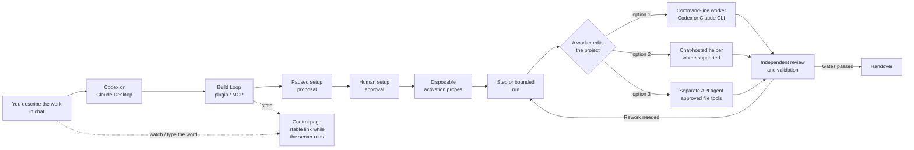
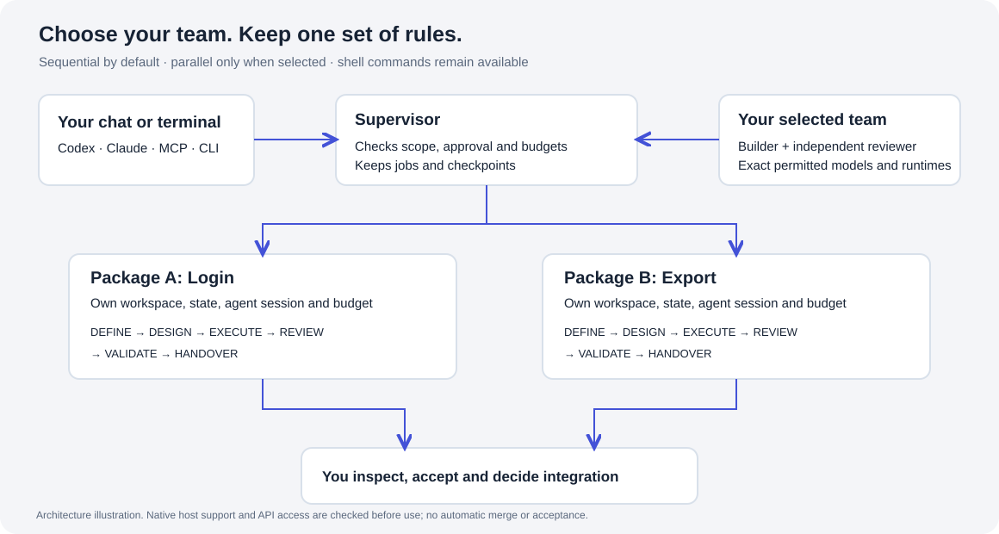
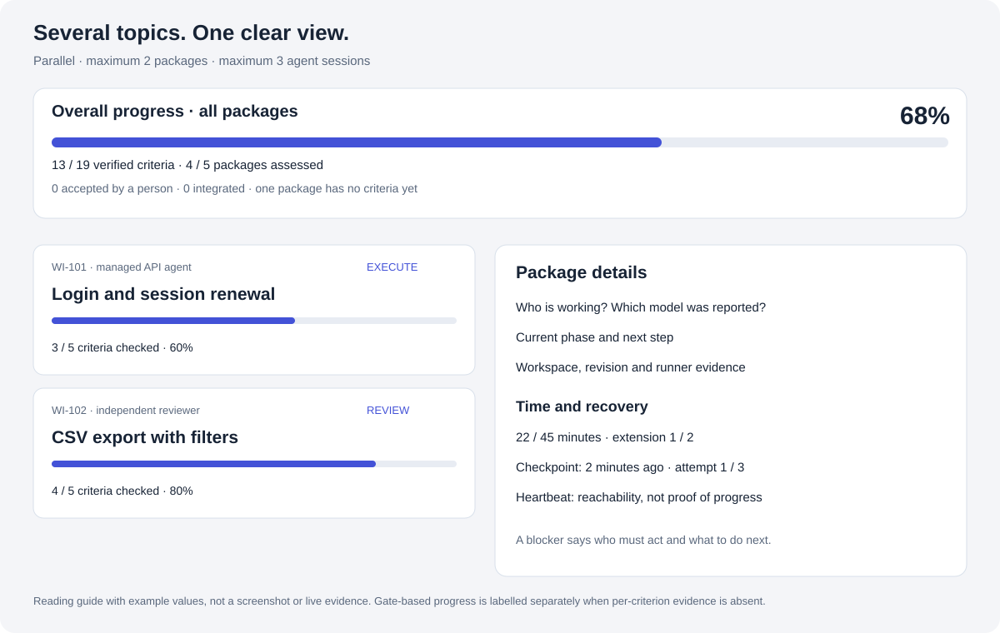
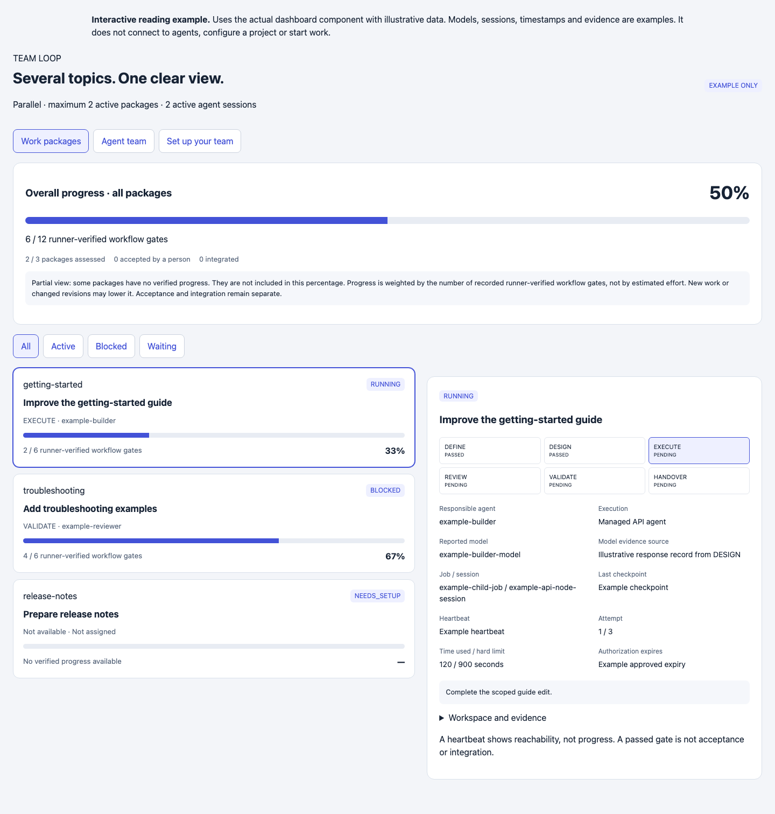
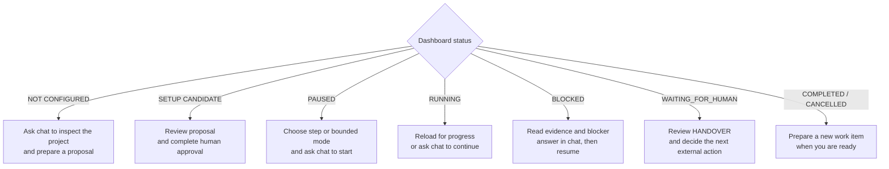

# Universal Build Loop

Build Loop turns a coding request into a controlled, six‑phase run: **DEFINE → DESIGN → EXECUTE → REVIEW → VALIDATE → HANDOVER**. You talk to it in plain language from Claude Desktop or the Codex app. It plans, asks for your approval, then works in small, reviewable steps.

Runs on macOS and Linux. Native Windows is not supported. WSL has not been validated.

---

## Two folders — keep them straight

| | What it is |
|---|---|
| **Package folder** | This checkout — the Build Loop source you install *from*. You build here once. |
| **Target‑project folder** | The repository you actually want changed. Build Loop reads and edits **this** one. |

For first use, choose a separate target folder. Below, `/absolute/path/to/package-root` means the full path to this checkout on your machine. Replace it with your real path — don't guess.

## Choose how the agents work

The **plugin or extension** connects your chat to Build Loop. The **worker**
performs a task. Choose the worker separately during setup:

| Choice | What you need | Where you see the work |
|---|---|---|
| Existing CLI worker | An installed, signed-in Codex CLI or Claude Code CLI | Chat status and the dashboard |
| Managed API agent | Your own API access and an explicitly selected model | Separate agent sessions in the dashboard; no agent CLI is started |
| Chat-hosted work | A host able to create a fresh helper for each step, plus an independent reviewer | Your host's agent view, where supported, and the dashboard |
| Test worker | No AI account; the bundled mock provider | A dry run that tests the workflow, not AI quality |

**Claude Desktop chat over MCP does not promise a native subagent panel.**
For automatic teams without agent CLI processes, choose managed API agents.
Native host delegation needs separate host verification; automatic native-only
team supervision is currently blocked. Explicit one-package chat steps remain
available. See [Teams](docs/TEAMS.md) for the supported combinations.

## Prerequisites

- macOS or Linux with **Bash 3.2+, `jq`, Git and Perl**. These run the workflow
  and approved project checks, even when the agents use an API.
- **Node.js 22+** for Codex, direct MCP and the CLI. **npm and zip** are needed
  to build the installation files once. The Desktop extension supplies Node.
- Credentials for the worker type you choose. A CLI login and an API key are
  different things. API billing is separate from an app subscription.

You can ask Codex to check and build the package for you. Installing the
extension never authorizes changes to your project.

---

## Install in Codex (easiest route)

### Step 1 — Build and install the plugin

1. Open the **package folder** (this checkout) in the Codex app.
2. Paste this request into the chat:

   > Please build this template’s local plugin and install it into Codex. Check the prerequisites and tell me what is missing. Do not initialize a loop or run target-project commands.

3. Let the agent run the build and install. It may execute:

   ```bash
   npm run bundle
   codex plugin marketplace add "/absolute/path/to/package-root/dist/codex"
   codex plugin add build-loop@build-loop-local
   ```

**Expected result:** the bundle is produced, both `codex plugin` commands succeed, and the agent reports concretely which prerequisites are present or missing (for example: `jq` found, Codex CLI signed in, `perl` missing).

**Manual fallback:** run the three commands above yourself in a terminal, from the package folder, substituting your real absolute path.

### Step 2 — Success check and first real use

1. Open your **target‑project folder** in Codex as a **new task**. This new task is where you will use the loop for your project.
2. Ask, in plain language:

   > Use Build Loop to inspect this repository, check its prerequisites, and show the available work kinds and run modes. Do not run project commands or initialize anything yet.

**Expected result:** Codex invokes a named Build Loop tool or skill and answers with **facts about your repository** — detected project signals, a possible verification command, provider readiness, and available work kinds. An unknown project or missing verifier should be reported clearly. Generic prose alone does not confirm installation: ask Codex to invoke the installed Build Loop skill and check `codex plugin list` if it cannot.

---

## Install in Claude Desktop

Claude Desktop installs a prebuilt `.mcpb` file. These instructions start from source, so **build the file first**. If you already received a built bundle from a maintainer, skip to Step 2.

### Step 1 — Build the `.mcpb`

Either open the **package folder** in Codex and ask:

> Please build the Claude Desktop extension bundle for this project and tell me the exact file path it produced.

Or run it yourself from the package folder:

```bash
npm run bundle
```

**Expected result:** the file `dist/build-loop.mcpb` exists inside the package folder. Note its full path.

### Step 2 — Install the extension

1. Open **Claude Desktop → Settings → Extensions → Advanced settings → Install Extension…**
2. Choose the `dist/build-loop.mcpb` file from Step 1.
3. When asked for **`project_root`**, enter the **absolute path to your target‑project folder**. It must already exist.
4. If you choose API agents, enter only the keys you need in the optional sensitive API-key fields. Leave these blank for CLI or chat workflows. Never paste keys into chat.
5. Enable the extension.

**Expected result:** Build Loop appears in the Extensions list as enabled, with your `project_root` shown.

### Step 3 — Success check and first real use

1. Start a **new chat**.
2. Ask:

   > Use Build Loop to inspect my selected project, check its prerequisites, and show the available work kinds and run modes. Do not run project commands or initialize anything yet.

**Expected result:** Claude calls a named Build Loop tool and reports real details of the project at your `project_root`, plus a clear list of anything missing (selected worker not ready, `jq` absent, and so on). If the reply is generic advice with no tool call, check that `loop_inspect`, `loop_doctor`, and `loop_options` appear among the connected tools.

These menu steps follow [Claude’s official installation guide](https://support.claude.com/en/articles/10949351-getting-started-with-local-mcp-servers-on-claude-desktop). The in-app installation has not been tested end to end here.

> Prefer raw MCP JSON configuration instead of the plugin/extension? See [docs/INSTALLATION.md](docs/INSTALLATION.md). Choose the plugin/extension **or** a direct MCP entry; installing both is not required.

---

## How a run actually works

1. **Prepare.** You describe the work and choose a builder and independent reviewer. The agent configures those providers and prepares the scope, verification commands, and limits. Build Loop returns a **paused candidate** for you to read. It does **not** return a dashboard link at this point.
2. **Request approval.** The request‑approval step (`loop_request_approval`) returns a **confirmation URL**. **A human must open and submit it personally.** The agent cannot do this for you.
3. **Activate.** Build Loop runs positive and negative probes against a **disposable copy** of your project, then inspects whether the job completed as expected.
4. **Start.** You choose the **run mode**. A worker then edits the project, one step (a *node*) at a time: a selected CLI worker, a managed API agent, or an explicit chat-hosted helper where supported.
5. **Control page.** `build-loop serve` (or `loop_serve` from chat) starts one long‑lived page and gives you a **single‑use link** to it: it opens the page once, within 10 minutes, and your browser then stays signed in for 12 hours. It shows the state, and its Decisions panel is where you type the word to accept, authorize, promote or release. Starting it decides nothing.



The chat is where you ask for actions. The control page shows recorded state,
and it is one of the two places where you make the human decisions (the other
is your terminal). You type the word yourself; the agent never does.

**Running the work inside the chat.** Instead of starting a separate
command‑line worker, the chat itself can do each step. Set it up with
`configure`, `host` `chat`, and **your choice of reviewer** in `review_host`:
`claude` or `codex` (a separate process, independent) or `chat` (this same
chat). There is no default: without that choice `loop_chat_next` refuses with
`CHAT_REVIEW_HOST_REQUIRED`. The chat asks for the next step
(`loop_chat_next`), which returns a `node_id` and a fresh `attempt_id`; it hands
only that step's instructions to a fresh sub‑agent and passes the answer back
with both ids (`loop_chat_submit`). An answer counts only when the waiting step
took it. The referee does not change: the engine still runs the tests and checks
every changed file. One honest limit: if the same chat also does the review,
that review is **not independent**. Status, check, the handover notes and the
accept decision then say so: "Review was not independently isolated (same
chat)". Pick the other tool (Codex from a Claude chat, Claude from a Codex chat)
to keep it independent. Details: [Who does the node work](docs/LOOP-MODES.md#who-does-the-node-work-a-separate-cli-process-or-this-chat).

### Run modes

- **step** — advances at most **one** node, then stops.
- **bounded** — advances up to a limit (**default 12** nodes) and stops earlier when blocked, at handover, or at a configured limit.

**REVIEW is mandatory in every mode.** More detail: [docs/LOOP-MODES.md](docs/LOOP-MODES.md).

### Kinds of work

**Feature, Bug fix, Refactoring / maintenance, Documentation, Research, or Migration preparation.** Choose in chat, or use the dashboard selectors to generate a prompt that you paste into chat. Every kind retains review and validation; migration execution needs separate authority.

### Talking to it

Start in plain language, for example:

> Prepare a bug fix for the failing login test. Keep the existing API unchanged.
> Show the proposal first; after approval, run one step and show the dashboard.

The agent translates the request into tool inputs and asks for any missing decisions.
Dashboard selectors can also prepare a request for you to copy into chat.

---

## Which kind of loop do you want?

There are four. All four run the same six phases, the same gates and the same
mandatory independent review. What changes is where the work comes from and who
decides when the next piece of it starts.


Below, `…` after `--root` stands for the absolute path to your target‑project folder.

| Loop | What it is for | In chat (Claude Desktop / Codex app) | On the command line |
|---|---|---|---|
| **Goal loop** | One work item, carried to HANDOVER. Then you read the evidence and decide. | *"Continue this work item in bounded mode for at most 12 nodes, then run a build‑loop check and tell me the run status, the judge verdict and the next action."* — to accept it, the agent's tool call hands you a **local confirmation page**; you open it, read the exact decision it shows, type `ACCEPT` into the field and press the button | `build-loop check --root … --json`, then `build-loop accept --root …` and type `ACCEPT` |
| **Backlog loop** | Several items in a written order. Accepting one promotes the next. | *"Add these three items to the backlog and start none of them, then list the backlog with the authorization state of each item."* — authorizing and accepting both return a **local confirmation page** that shows the exact decision, including the paths, the budget and the expiry; you type `AUTHORIZE` or `ACCEPT` into its field yourself | `build-loop backlog_add --root … --input '{"title":"…","outcome":"…"}'`, then `build-loop authorize --root …` and `build-loop accept --root …`, typing the word each time |
| **Cadence / schedule loop** | A timer moves the run along, inside limits you wrote down beforehand. | *"Every 30 minutes, call tick on this project and tell me only when the action is not nothing."* — a timer can never accept, authorize or promote | `build-loop tick --root …`, driven by Claude Code `/loop` or `/schedule`, a Codex Automation, or `cron` |
| **Scout loop** | Finding work at all: read‑only discovery that fills an inbox you triage. | *"Scout this project and show me what came back. Do not promote anything."* — promoting one returns a **local confirmation page** showing the proposal it is bound to; you type `PROMOTE` into its field | `build-loop scout --root …`, then `build-loop inbox_list --root …` and `build-loop promote --root …` and type `PROMOTE` |

**What is never automatic.** Accepting a result, authorizing an item to start
later, promoting a scout proposal, and taking a project‑wide hold off are
decisions only a person makes. Each completes in one of two ways: you type its
word — `ACCEPT`, `AUTHORIZE`, `PROMOTE` or `RELEASE` — at an interactive
terminal, or you type the same word into the field
on a local confirmation page and press the button. Every other route, including a
chat tool call and a script's input file, completes nothing: it returns a link to
that page, bound to that one operation, that one item and the exact decision that
was frozen when the link was made, and the agent has to hand the link to you
rather than open it. If the run, the proposal or the decision changes in the
meantime, the confirmation is refused rather than applied to something else.
The easiest place to type these words is the control page (see
[Use the control page](#use-the-control-page)); it also works from your phone
inside your home network or VPN.

Both routes are recorded with the assurance `local-user-action`: a person with
access to this machine did it. Be honest about what that is worth — an agent
with shell access on the same computer could in principle open the link too. If
you need a harder guarantee, put `{"schema_version": 1, "human_confirmation":
"tty-only"}` into `.loop/control/policy.json` by hand. Chat tool calls and input
files are then refused outright with `CONFIRMATION_TTY_ONLY` and the exact
command to run — the whole decision travels with it through `--input` — and only
a word typed at an interactive terminal decides.

Authorizing is a permission to start, never approval of a result.
Scope changes and anything under protected paths need a person. Merging,
pushing, deploying, releasing, flashing a device and running a migration are
always separate human actions after a handover.

**`handover_ready` is not success.** It means only that there is something for
you to look at. Verified success is a recorded review verdict of `PASS`
together with a passed VALIDATE gate — `check` reports the verdict separately
as `judge_verdict` so the two are never confused.

Full explanation: [docs/LOOP-MODES.md](docs/LOOP-MODES.md). Ten step‑by‑step
walkthroughs on the example projects, in chat and on the command line:
[docs/examples/loops/README.md](docs/examples/loops/README.md) — including a
five‑minute [dry run](docs/examples/loops/dry-run.md) with the mock provider that
costs nothing. Where these ideas come from:
[docs/SOURCES.md](docs/SOURCES.md).

### Status

| Capability | Status |
|---|---|
| One work item carried to handover (goal loop) | Implemented |
| Several work items in an ordered backlog | Implemented — `backlog_add`, `backlog_list`, `backlog_remove` |
| Letting an item start later, with scope, budget and expiry | Implemented — `authorize`, `deauthorize` |
| Stopping everything in a project at once | Implemented — `hold`, and `deauthorize`; only `release` takes it off |
| Accepting a finished run and promoting the next item | Implemented — `accept` |
| Cadence and scheduled runs | Implemented — `tick`, driven by a client schedule or `cron` |
| Discovery into a triaged inbox (scout loop) | Implemented — `scout`, `inbox_list`, `promote`, `discard` |
| A note carried from one cycle to the next | Implemented — advisory only, approves nothing |
| A control page to watch the project and type decisions, also from a phone on your private network | Implemented — `serve`; without it (and without `confirmation_page`), `dashboard` opens the older read‑only page that stops after 30 minutes |
| Doing the node work inside the chat instead of a separate CLI | Implemented — `configure` with `host` `chat` and an explicit `review_host`, then `chat_next` and `chat_submit` (with `node_id` and `attempt_id`); the review is independent only when `review_host` is another tool |
| Merge, push, deploy, release, device flashing, live migration | Not automated, by design — human actions |
| Native Windows | Not supported; WSL has not been validated |

## Work on several topics

Start with one package at a time. Choose parallel work explicitly when the
packages can be developed independently. Each package has its own workspace,
review, validation and time allowance.

> Set up two independent packages: update the getting-started guide and the
> troubleshooting guide. Allow two packages at a time. Ask which builder and
> reviewer may help. Show their exact models, file access and time limits.
> Prepare one combined team-and-setup review, then ask me to authorize each
> work package when its scope is ready.



The supervisor schedules **already approved** packages. Shared paths or named
resources make conflicting packages wait. It records checkpoints and keeps
consumed budgets when you reconnect. Only a pre-approved time reserve may be
used; approval expiry and hard limits remain in force.



*Reading guide with example values, not a screenshot or a live result.*

**Read the label next to the bar.** Current team status counts passed workflow
gates backed by evidence. For example, package A has 4/6 gates and package B
has 2/6: the total is **6/12 = 50%**. If another package has no state yet, the
page labels that percentage **partial** and reports the missing coverage.
A full bar means all counted gates passed. Human acceptance and integration
remain separate; the page does not infer that code was merged.

See [Teams: setup, limits and recovery](docs/TEAMS.md),
[the team demonstration](examples/team-demo/README.md),
[the Notes and CSV practice project](examples/team-project/README.md), and
[the dashboard guide](docs/DASHBOARD.md).



*Screenshot of the interactive reading example. The models, sessions and
evidence shown here are illustrative. Open [the HTML example](docs/design/team-dashboard.html)
in your browser to try the package filters and setup request form.*

On GitHub, download the HTML file first, then open the saved file in your
browser. The GitHub file view itself shows source code.

## Use the control page

For a team, this is your **main dashboard**: package progress, agent status and
human decisions belong on this one page.

The compact team view starts with **Work packages** and the overall progress bar.
Select a package to see its next step beside the list. Use **Agent team**,
**Set up your team**, or **Approvals** for the other views. The Approvals badge
counts pending decisions; open one card to review it. Runtime details and the
older single-project view are expandable, so you do not have to scroll through
everything to find a decision.

Ask:

> Open the main Build Loop dashboard for this team. Put the team approval,
> every registered package setup, and later work authorizations in its
> Approvals tab. Prepare the combined team-and-setup review. Do not approve
> anything for me.

The assistant starts `serve` on the team controller **before** requesting
approvals. Once all setups are prepared, one card shows the team and all
package setups. You type `AUTHORIZE` **once** for that exact group. The
assistant then runs each setup's checks. Later, you type `AUTHORIZE` for each
work package, after reading its allowed files, time limit and expiry. For two
packages, that is **three decisions instead of five**. The combined decision
alone starts no work. The earlier separate team and setup approvals still work.

The opening link works once, within ten minutes. After opening it, keep that
browser tab or bookmark the clean page address: its session lasts twelve hours.
If the opening link expired or your session ended, ask for a fresh dashboard
link; that creates no approval.


The control page is one small web page on your own computer. It shows the state
of the project, and its **Decisions** panel is where you type the word for a
human decision. Start it once, from the terminal or from chat:

```bash
build-loop serve --root /absolute/path/to/target-project
```

> Start the Build Loop control page and give me its link.

(The agent calls `loop_serve`.) You get a **single‑use link**. It opens the page
once, within 10 minutes; your browser then stays signed in for 12 hours. Ask
again whenever you need a fresh one. A chat never sees the page's lasting key:
that key stays in a private file on your machine. If you want a link you can
bookmark, run `build-loop serve --root … --show-link` yourself at a terminal; it
prints the lasting link, and only there. Keep any link private, because the page
shows project paths, work‑item text, blockers and evidence. `--rotate` makes a
new key (old links and sessions stop working), `--stop` ends the page. Asking for
the dashboard (`loop_dashboard`) returns a fresh single‑use link while the page
runs.

**From your phone.** Set `confirmation_page` in `.loop/control/policy.json`, and
the link works from your phone inside your home network or a VPN. The page is
plain web traffic, so never open it to the internet. How to set it:
[docs/CONFIGURATION.md](docs/CONFIGURATION.md#the-policy-file-who-may-decide-and-from-where).
You do not need a service to keep the page running: once `confirmation_page` is
set, the page starts itself on the next tick or decision, also after a reboot.

**Deciding.** When a decision waits, the Decisions panel shows exactly what it
will do. You type the word — `ACCEPT`, `AUTHORIZE`, `PROMOTE` or `RELEASE` — and
press the button. Only then is it recorded. Typing the word records *your
decision*; it does not mean the run succeeded.


*Illustrated example; your project name, work item, phase, evidence, and blocker
text will be different.*

Read the page from top to bottom:

| Page area | What it tells you | What you do next |
|---|---|---|
| **Project progress** | The whole project at a glance: a bar and "3 of 6 items done · 1 in progress · 2 queued"; the item list is folded under **Items** | Nothing; it shows where the project stands, not what to do |
| **Status** | One literal state: `NOT CONFIGURED`, `SETUP CANDIDATE`, `PAUSED`, `RUNNING`, `BLOCKED`, `WAITING_FOR_HUMAN`, `COMPLETED`, or `CANCELLED` | Follow the displayed next action |
| **Decisions** | A decision that waits for you (accept, authorize, promote, release), frozen exactly as it was asked for; or buttons to prepare one, and **Hold** to stop everything | Read it, type its word and press the button. Hold needs no word |
| **Workflow** | Which of DEFINE, DESIGN, EXECUTE, REVIEW, VALIDATE, and HANDOVER is current and which gates have evidence. Gate states include `PASSED`, `FAILED`, and `PENDING`. **Round** counts workflow transitions and rework against a separate safety cap | A failed gate normally means rework; a pending gate has not been completed yet |
| **Choose your next loop** | Builds a prompt for a work kind and either one step or a bounded run | Copy the generated prompt into Codex or Claude; selecting an option alone changes nothing |
| **Current job** | The most recently recorded job, its node count, and how it runs (a separate CLI, or chat‑hosted and who reviews). A bounded run's node limit is separate from the workflow round limit | Reload to see newer records; treat it as progress information, not proof that a gate passed |
| **Blockers** | A missing decision or hard gate failure | Answer the open question in chat, then ask the agent to resume |
| **Evidence** | The recorded checks and their PASSED, FAILED, or BLOCKED results | Use the phase gates for the overall result; individual failures can belong to an earlier rework attempt |
| **Work item** | Scope, acceptance criteria, slices, and handover notes | Expand it when you need to check what the agent is allowed to do |

Use the status as your decision point:



### Example: understand a blocked run

Suppose the dashboard shows:

```text
Status: BLOCKED                 Work item: WI-001
Current phase: VALIDATE         Round: 6 / 40
Blocker: Expected API response differs from the accepted contract.
Workflow: DEFINE PASSED  DESIGN PASSED  EXECUTE PASSED
          REVIEW PASSED  VALIDATE FAILED  HANDOVER PENDING
```

This means the loop reached validation, recorded a failure, and needs a human
decision before it can continue. Ask the agent to explain it without changing
anything:

> Explain the open dashboard blocker in plain language. Show the failed
> evidence and the available choices. Do not resume yet.

After you decide, answer the blocker and keep the next action small:

> For the open blocker, keep the accepted API contract and adjust the
> implementation. Record that decision, resume for one step, and then show me
> the updated dashboard.

### Example: continue a healthy run

If the status is `RUNNING`, first decide how far the loop may proceed:

> Continue for one step, stop at the next node boundary, and show the dashboard.

Or allow a bounded sequence:

> Continue in bounded mode for at most 12 nodes. Stop earlier for any blocker
> or at handover, then show the dashboard.

When the dashboard shows `WAITING_FOR_HUMAN` in `HANDOVER`, the automated work
has reached its review point. Read the work item and evidence, then ask:

> Summarize the handover, changed files, validation evidence, and remaining
> risks. Do not merge, push, deploy, or release anything.

### Dashboard from the shell

The original shell path produces a static HTML file and remains supported.
Render it from the package folder:

```bash
cd /absolute/path/to/package-root
./engine/render-dashboard.sh --root /absolute/path/to/target-project
```

Then open it on macOS:

```bash
open /absolute/path/to/target-project/.loop/dashboard.html
```

Or on Linux:

```bash
xdg-open /absolute/path/to/target-project/.loop/dashboard.html
```

The static file does not expire, but it becomes stale as soon as the loop state
changes. Run the renderer again to update it. Keep the file private for the same
reason as the local link. The shell dashboard and the chat/MCP dashboard read
the same `.loop/` state, but the chat/MCP link can be refreshed in place until
its server stops.

For every field, evidence source, and limitation, see
[docs/DASHBOARD.md](docs/DASHBOARD.md).

---

## The shell orchestrator

The original shell entry point remains fully supported alongside the plugin, including `engine/render-dashboard.sh` for local dashboard rendering. See [docs/SHELL-ORCHESTRATOR.md](docs/SHELL-ORCHESTRATOR.md).

---

## More documentation

- [docs/TEAMS.md](docs/TEAMS.md) — team setup, parallel work, API agents and recovery
- [examples/team-demo/README.md](examples/team-demo/README.md) — the two-package example and what its tests prove
- [examples/team-project/README.md](examples/team-project/README.md) — a small app with two independent improvements to try with your chosen agents
- [docs/INSTALLATION.md](docs/INSTALLATION.md) — every install path, including raw MCP JSON
- [docs/LOOP-MODES.md](docs/LOOP-MODES.md) — the four kinds of loop, run modes, work kinds, what is never automatic
- [docs/DASHBOARD.md](docs/DASHBOARD.md) — the control page, phone access, and other ways to see the state
- [docs/ORCHESTRATOR.md](docs/ORCHESTRATOR.md) — the six phases in depth
- [docs/VALIDATION.md](docs/VALIDATION.md) — probes, disposable copies, completion checks
- [docs/SHELL-ORCHESTRATOR.md](docs/SHELL-ORCHESTRATOR.md) — shell usage
- [docs/examples/README.md](docs/examples/README.md) — worked examples
- [docs/examples/loops/README.md](docs/examples/loops/README.md) — ten step‑by‑step walkthroughs, from a five‑minute dry run to the full cycle
- [docs/SOURCES.md](docs/SOURCES.md) — sources and further reading, and how this template relates to them
