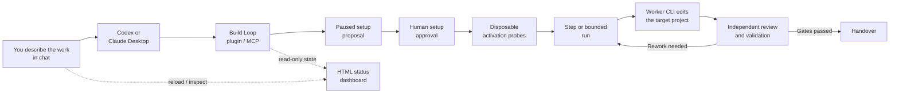
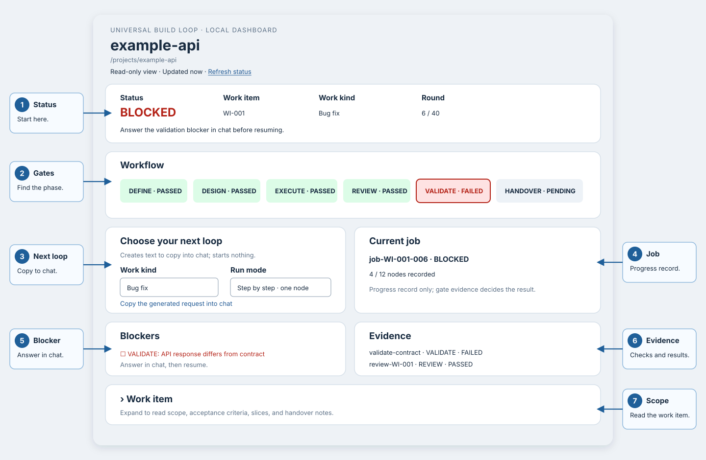
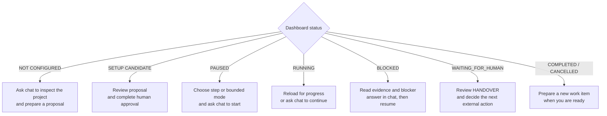

# Universal Build Loop

Build Loop turns a coding request into a controlled, six‑phase run: **DEFINE → DESIGN → EXECUTE → REVIEW → VALIDATE → HANDOVER**. You talk to it in plain language from Claude Desktop or the Codex app. It plans, asks for your approval, then works in small, reviewable steps.

Runs on macOS and Linux. Native Windows is not supported. WSL has not been validated.

---

## Two folders — keep them straight

| | What it is |
|---|---|
| **Package folder** | This checkout — the Build Loop source you install *from*. You build here once. |
| **Target‑project folder** | The repository you actually want changed. Build Loop reads and edits **this** one. |

For first use, choose a separate target folder. Below, `/absolute/path/to/package-root` means the full path to this checkout on your machine. Replace it with your real path — don't guess.

## Two pieces — also keep them straight

- **The plugin / extension** is the *installation*. It gives your app the Build Loop tools.
- **The worker CLI** is *separate*. Build Loop drives an already‑installed, already‑signed‑in **Codex CLI** or **Claude Code CLI** to do the actual editing. Installing the plugin does not install or log in the worker.

## Prerequisites

- **Bash 3.2+, `jq`, `git`, `perl`** available in your shell.
- **Node.js 22+, `npm`, and `zip`** — needed to *build* the package. The Codex plugin and direct MCP also require Node.js 22+ at runtime.
- A **worker CLI you have already authenticated**: Codex CLI or Claude Code CLI. Files existing on disk is not proof; you are set only if you have actually run the CLI and signed in.

Claude Desktop ships its own Node runtime for the extension, but the Unix tools and the authenticated worker above are still required.

---

## Install in Codex (easiest route)

### Step 1 — Build and install the plugin

1. Open the **package folder** (this checkout) in the Codex app.
2. Paste this request into the chat:

   > Please build this template’s local plugin and install it into Codex. Check the prerequisites and tell me what is missing. Do not initialize a loop or run target-project commands.

3. Let the agent run the build and install. It may execute:

   ```bash
   npm run bundle
   codex plugin marketplace add "/absolute/path/to/package-root/dist/codex"
   codex plugin add build-loop@build-loop-local
   ```

**Expected result:** the bundle is produced, both `codex plugin` commands succeed, and the agent reports concretely which prerequisites are present or missing (for example: `jq` found, Codex CLI signed in, `perl` missing).

**Manual fallback:** run the three commands above yourself in a terminal, from the package folder, substituting your real absolute path.

### Step 2 — Success check and first real use

1. Open your **target‑project folder** in Codex as a **new task**. This new task is where you will use the loop for your project.
2. Ask, in plain language:

   > Use Build Loop to inspect this repository, check its prerequisites, and show the available work kinds and run modes. Do not run project commands or initialize anything yet.

**Expected result:** Codex invokes a named Build Loop tool or skill and answers with **facts about your repository** — detected project signals, a possible verification command, provider readiness, and available work kinds. An unknown project or missing verifier should be reported clearly. Generic prose alone does not confirm installation: ask Codex to invoke the installed Build Loop skill and check `codex plugin list` if it cannot.

---

## Install in Claude Desktop

Claude Desktop installs a prebuilt `.mcpb` file. These instructions start from source, so **build the file first**. If you already received a built bundle from a maintainer, skip to Step 2.

### Step 1 — Build the `.mcpb`

Either open the **package folder** in Codex and ask:

> Please build the Claude Desktop extension bundle for this project and tell me the exact file path it produced.

Or run it yourself from the package folder:

```bash
npm run bundle
```

**Expected result:** the file `dist/build-loop.mcpb` exists inside the package folder. Note its full path.

### Step 2 — Install the extension

1. Open **Claude Desktop → Settings → Extensions → Advanced settings → Install Extension…**
2. Choose the `dist/build-loop.mcpb` file from Step 1.
3. When asked for **`project_root`**, enter the **absolute path to your target‑project folder**. It must already exist.
4. Enable the extension.

**Expected result:** Build Loop appears in the Extensions list as enabled, with your `project_root` shown.

### Step 3 — Success check and first real use

1. Start a **new chat**.
2. Ask:

   > Use Build Loop to inspect my selected project, check its prerequisites, and show the available work kinds and run modes. Do not run project commands or initialize anything yet.

**Expected result:** Claude calls a named Build Loop tool and reports real details of the project at your `project_root`, plus a clear list of anything missing (worker CLI not authenticated, `jq` absent, and so on). If the reply is generic advice with no tool call, check that `loop_inspect`, `loop_doctor`, and `loop_options` appear among the connected tools.

These menu steps follow [Claude’s official installation guide](https://support.claude.com/en/articles/10949351-getting-started-with-local-mcp-servers-on-claude-desktop). The in-app installation has not been tested end to end here.

> Prefer raw MCP JSON configuration instead of the plugin/extension? See [docs/INSTALLATION.md](docs/INSTALLATION.md). Choose the plugin/extension **or** a direct MCP entry; installing both is not required.

---

## How a run actually works

1. **Prepare.** You describe the work and choose a builder and independent reviewer. The agent configures those providers and prepares the scope, verification commands, and limits. Build Loop returns a **paused candidate** for you to read. It does **not** return a dashboard link at this point.
2. **Request approval.** The request‑approval step (`loop_request_approval`) returns a **confirmation URL**. **A human must open and submit it personally.** The agent cannot do this for you.
3. **Activate.** Build Loop runs positive and negative probes against a **disposable copy** of your project, then inspects whether the job completed as expected.
4. **Start.** You choose the **run mode**.
5. **Dashboard.** A separate dashboard request returns a **read‑only** dashboard URL. It **expires after 30 minutes**. Reload it for current state; request a fresh link after expiry. The dashboard is never used for approval.



The chat is where you make decisions and request actions. The dashboard only
shows recorded state; it cannot approve setup, start a run, or change files.

### Run modes

- **step** — advances at most **one** node, then stops.
- **bounded** — advances up to a limit (**default 12** nodes) and stops earlier when blocked, at handover, or at a configured limit.

**REVIEW is mandatory in every mode.** More detail: [docs/LOOP-MODES.md](docs/LOOP-MODES.md).

### Kinds of work

**Feature, Bug fix, Refactoring / maintenance, Documentation, Research, or Migration preparation.** Choose in chat, or use the dashboard selectors to generate a prompt that you paste into chat. Every kind retains review and validation; migration execution needs separate authority.

### Talking to it

Start in plain language, for example:

> Prepare a bug fix for the failing login test. Keep the existing API unchanged.
> Show the proposal first; after approval, run one step and show the dashboard.

The agent translates the request into tool inputs and asks for any missing decisions.
Dashboard selectors can also prepare a request for you to copy into chat.

## Understand the dashboard

Ask for it from the target-project chat at any time, including before setup:

> Show the Build Loop dashboard for this project.

The agent calls `loop_dashboard` and returns a local URL. Open the link in your
browser. It is read-only, and its local server stops 30 minutes after the link
is issued. The page shows the state recorded when you load it. Reload for newer
data; ask for a fresh link after expiry. Keep the link private because the page
contains project paths, work-item text, blockers, and evidence summaries.



*Illustrated example; your project name, work item, phase, evidence, and blocker
text will be different.*

Read the page from top to bottom:

| Dashboard area | What it tells you | What you do next |
|---|---|---|
| **Status** | One literal state: `NOT CONFIGURED`, `SETUP CANDIDATE`, `PAUSED`, `RUNNING`, `BLOCKED`, `WAITING_FOR_HUMAN`, `COMPLETED`, or `CANCELLED` | Follow the displayed next action; use chat for every change |
| **Workflow** | Which of DEFINE, DESIGN, EXECUTE, REVIEW, VALIDATE, and HANDOVER is current and which gates have evidence. Gate states include `PASSED`, `FAILED`, and `PENDING`. **Round** counts workflow transitions and rework against a separate safety cap | A failed gate normally means rework; a pending gate has not been completed yet |
| **Choose your next loop** | Builds a prompt for a work kind and either one step or a bounded run | Copy the generated prompt into Codex or Claude; selecting an option alone changes nothing |
| **Current job** | The most recently recorded job and its node count. A bounded run's node limit is separate from the workflow round limit | Reload to see newer records; treat it as progress information, not proof that a gate passed |
| **Blockers** | A missing decision or hard gate failure | Answer the open question in chat, then ask the agent to resume |
| **Evidence** | The recorded checks and their PASSED, FAILED, or BLOCKED results | Use the phase gates for the overall result; individual failures can belong to an earlier rework attempt |
| **Work item** | Scope, acceptance criteria, slices, and handover notes | Expand it when you need to check what the agent is allowed to do |

Use the status as your decision point:



### Example: understand a blocked run

Suppose the dashboard shows:

```text
Status: BLOCKED                 Work item: WI-001
Current phase: VALIDATE         Round: 6 / 40
Blocker: Expected API response differs from the accepted contract.
Workflow: DEFINE PASSED  DESIGN PASSED  EXECUTE PASSED
          REVIEW PASSED  VALIDATE FAILED  HANDOVER PENDING
```

This means the loop reached validation, recorded a failure, and needs a human
decision before it can continue. Ask the agent to explain it without changing
anything:

> Explain the open dashboard blocker in plain language. Show the failed
> evidence and the available choices. Do not resume yet.

After you decide, answer the blocker and keep the next action small:

> For the open blocker, keep the accepted API contract and adjust the
> implementation. Record that decision, resume for one step, and then show me
> the updated dashboard.

### Example: continue a healthy run

If the status is `RUNNING`, first decide how far the loop may proceed:

> Continue for one step, stop at the next node boundary, and show the dashboard.

Or allow a bounded sequence:

> Continue in bounded mode for at most 12 nodes. Stop earlier for any blocker
> or at handover, then show the dashboard.

When the dashboard shows `WAITING_FOR_HUMAN` in `HANDOVER`, the automated work
has reached its review point. Read the work item and evidence, then ask:

> Summarize the handover, changed files, validation evidence, and remaining
> risks. Do not merge, push, deploy, or release anything.

### Dashboard from the shell

The original shell path produces a static HTML file and remains supported.
Render it from the package folder:

```bash
cd /absolute/path/to/package-root
./engine/render-dashboard.sh --root /absolute/path/to/target-project
```

Then open it on macOS:

```bash
open /absolute/path/to/target-project/.loop/dashboard.html
```

Or on Linux:

```bash
xdg-open /absolute/path/to/target-project/.loop/dashboard.html
```

The static file does not expire, but it becomes stale as soon as the loop state
changes. Run the renderer again to update it. Keep the file private for the same
reason as the local link. The shell dashboard and the chat/MCP dashboard read
the same `.loop/` state, but the chat/MCP link can be refreshed in place until
its server stops.

For every field, evidence source, and limitation, see
[docs/DASHBOARD.md](docs/DASHBOARD.md).

---

## The shell orchestrator

The original shell entry point remains fully supported alongside the plugin, including `engine/render-dashboard.sh` for local dashboard rendering. See [docs/SHELL-ORCHESTRATOR.md](docs/SHELL-ORCHESTRATOR.md).

---

## More documentation

- [docs/INSTALLATION.md](docs/INSTALLATION.md) — every install path, including raw MCP JSON
- [docs/LOOP-MODES.md](docs/LOOP-MODES.md) — step and bounded modes, gates
- [docs/DASHBOARD.md](docs/DASHBOARD.md) — read‑only dashboard and link expiry
- [docs/ORCHESTRATOR.md](docs/ORCHESTRATOR.md) — the six phases in depth
- [docs/VALIDATION.md](docs/VALIDATION.md) — probes, disposable copies, completion checks
- [docs/SHELL-ORCHESTRATOR.md](docs/SHELL-ORCHESTRATOR.md) — shell usage
- [docs/examples/README.md](docs/examples/README.md) — worked examples
