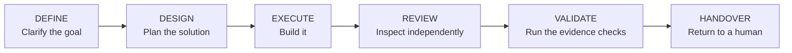

# Universal Autonomous Build Loop

A reusable foundation for planning, building, and verifying different kinds of
software projects with the same controlled process.


## Who is this template for?

Use this template when you want one clear and auditable development process for
different kinds of projects, including:

- CLI tools, APIs, and services
- desktop applications and automations
- libraries and packages
- data and AI projects
- documentation-only projects

The project may use Python, Java, Go, Rust, C#, C++, Node.js, another
technology, or no programming language at all.

## The idea in plain language

Think of a construction project:

- The **construction process** stays the same: clarify, plan, build, inspect,
  test, and hand over.
- The **building materials** may change. In a software project, these are the
  language, runtime, tools, and target platform.
- The **site manager's tools** may change too. The included reference engine
  uses Bash and `jq` on a Unix-like system.

A Python CLI and a Java API can therefore use the same process without making
the process itself dependent on Python or Java.

## Start in 5 minutes

### 1. Get the template and run its checks

The reference implementation needs a Unix-like control host with Git, Bash 3+,
`jq`, Perl, and standard command-line utilities. The prerequisite check lists
anything missing.

```bash
git clone <repository-url>
cd autonomous-build-loop-universal-template
./bootstrap/check-prerequisites.sh
./tests/run-bootstrap-recommend.sh
./tests/run-conformance.sh
```

Replace `<repository-url>` with the HTTPS or SSH URL shown by your Git host.
The recommendation suite checks safe project discovery. The conformance suite
checks the same reference engine against both a Python CLI and a
documentation-only project.

Run initialization only from a clean template checkout. If tracked files are
modified or untracked files are present, the initializer stops because the Git
revision would not identify all code involved in generating the candidate.

The suite also proves that malformed configuration, missing tools, timeouts,
unauthorized file changes, symlink escapes, changed evidence, and illegal state
transitions fail instead of being accepted silently.

### 2. Configure your project

```bash
./bootstrap/init.sh /absolute/path/to/your/project
```

The initializer asks you to choose:

1. the kind of project;
2. the programming language, or `none`;
3. the runtime, compiler, or interpreter;
4. the build, package, and test tools;
5. the platforms, artifacts, and exact verification commands;
6. the evidence required for a successful run.

Before asking, it safely inspects a bounded set of file names and known
manifest fields. It then shows labeled recommendations with their confidence
and basis. Press Enter to accept an ordinary recommendation, or type a
replacement. Suggested command arrays are treated more carefully: the
initializer shows the exact array but accepts it only after you type
`USE-RECOMMENDED`. It never executes a discovered project command.

Supported platforms and the known-failing negative control always require
manual input. If the initializer cannot make a defensible artifact-path or
command recommendation, it asks for one instead of inventing a value.


Example answers for a small project:

| Question | Example answer |
|---|---|
| Project kind | `cli` |
| Language | `Python` |
| Runtime | `CPython >=3.12` |
| Tools | `pytest` |
| Platform | `macos-arm64` |
| Verification command | `["python3","-m","pytest","-q"]` |

> **Important:** The initializer creates configuration files. It does not start
> a loop or enable any automation.

The candidate files are written to the target project:

```text
.loop/candidate/
├── project.adapter.json
├── state.json
├── initialization.answers
├── initialization.provenance.json
└── ACTIVATION-CHECKLIST.md
```

Review the checklist next. The configuration remains `PAUSED` until a human has
confirmed every command, boundary, and evidence requirement.
`initialization.provenance.json` records what was recommended, what was accepted,
and what was entered manually.

## The workflow for every task



Every project follows this exact sequence. `REVIEW` and `VALIDATE` cannot be
skipped. Missing decisions become visible blockers instead of hidden guesses.

## What stays fixed, and what can change?

| Layer | Meaning | Example |
|---|---|---|
| Workflow | The fixed development process | `DEFINE` through `HANDOVER` |
| Project configuration | The project kind and technology | Python CLI, Rust library, documentation |
| Host and engine | Runs controlled steps | Bash/`jq` reference engine with Codex or Claude |

Dependencies point inward: project and host adapters may use the core contract,
but the core contract does not know any programming language or framework.

## Where are the results?

- `.loop/candidate/` contains configuration that has not been activated.
- `.loop/evidence/` contains structured evidence and captured command output.
- `core/` defines the invariant workflow.
- `profiles/` contains starting points for different project kinds.
- `spec/schemas/` defines the machine-readable file formats.
- `engine/` contains the current reference implementation.

## Deliberate limits

- This template is not an unattended autopilot.
- It cannot guarantee good software. It makes decisions, checks, and evidence
  visible and auditable.
- Version 0.1 includes only the Unix reference implementation using Bash and
  `jq`.
- Publishing, deployment, and irreversible external actions remain outside the
  engine and require explicit human approval.
- Alternative engines may implement the same contracts, but none are currently
  included or enabled automatically.

## More documentation

- [Step-by-step quickstart](docs/QUICKSTART.md)
- [Architecture and boundaries](docs/ARCHITECTURE.md)
- [Adding profiles and adapters](docs/EXTENDING.md)
- [Bootstrap protocol](bootstrap/README.md)
- [Initialization questions](template/INITIALIZATION.md)
