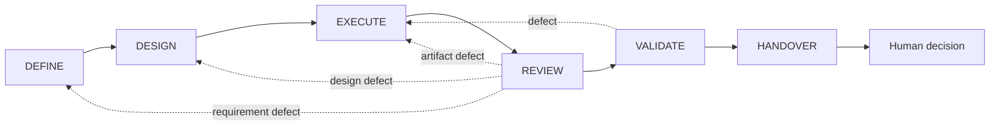
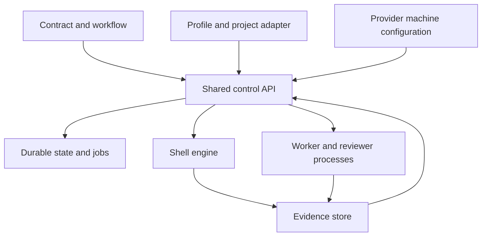

# Universal Build Loop

Universal Build Loop is a local control layer for AI-assisted software work. It
turns a request into one bounded work item, runs it through fixed gates, records
the evidence produced by those gates, and stops before an external action needs
human authority.

You can operate it from Codex, from Claude Desktop through a local MCP server,
from the Node.js command line, or through the original shell scripts. All entry
points use the same project configuration and the same workflow:



The worker may create artifacts. It cannot declare its own gate passed. The
control engine runs declared checks, enforces path boundaries, records evidence,
and validates an independent review. Handover reports what was proved and what
still needs a decision; it does not imply permission to merge, publish, release,
deploy, migrate data, access secrets, or make another external change.

## Choose an entry point

| Entry point | Best for | Control-plane requirements |
|---|---|---|
| Codex chat | Working in a repository with the bundled build-loop skill | Codex, Node.js 22+, Bash 3.2+, `jq`, Git, and Perl |
| Claude Desktop | Starting and supervising work from a desktop conversation | The local extension; Desktop supplies Node, while Bash, `jq`, Git, and Perl remain required |
| Node CLI | Scripts, CI experiments, and direct inspection | Node.js 22+, Bash 3.2+, `jq`, Git, and Perl |
| Shell scripts | Existing integrations and Unix-first workflows | Bash 3.2+, `jq`, Git, Perl, and standard Unix tools |

The control-plane runtime is separate from the target runtime. A Python target
still needs Python; a Rust target still needs Rust; browser validation may need
a browser. If the loop will call Claude Code or Codex as a worker, that CLI must
also be installed and authenticated separately. Installing the MCP server or
Claude Desktop extension does not install or authenticate a worker.

The current control package targets macOS and Linux environments with its Unix
dependencies; consult the validation matrix for environments actually tested.
Native Windows is unsupported and has not been validated. The Node control
delegates to Bash tools and Unix process behavior.

Install or load a chat integration before opening an unrelated target:
[Codex plugin](hosts/README.md#install-the-codex-plugin) or
[Claude Desktop extension](hosts/README.md#install-the-claude-desktop-extension).
Merely opening the target does not discover a skill stored in this package.

## Start from chat

Open the target repository in Codex or connect the project-bound MCP server to
Claude Desktop. Inspect the project and check local prerequisites first:

> Inspect this project for the Universal Build Loop and check its prerequisites.
> Do not run project commands, write configuration, or activate anything.

Then give the initial bounded request and ask the client to prepare it. The
prepared proposal includes the first work item, target adapter, and activation
probes. Check the detected facts and commands, then ask the client to request
approval. The client shows a local URL; you must open it and press Approve
yourself. The model must never fetch or submit that URL. Approval binds to the
displayed setup probes and conditional activation. There is no typed hash and
no generic `confirmed: true` bypass.

Preparation includes the initial work item. For example:

> Create a work item for adding CSV export. Keep the existing API stable and
> do not publish anything. Prepare the setup but do not run commands.

After approval and activation, continue:

> Start the work item and show me its status.

> The blocker is resolved: use the existing `csv` package and resume.

> Prepare the handover. Do not merge or deploy.

The task operation creates a later work item only after the previous result has
been acknowledged and completed. For a normal result, acknowledge the passed
HANDOVER gate. For a cancelled run, use handover to acknowledge the cancellation
before creating the next task.

The MCP transport and the skill are interfaces to the engine. They do not own
gates, alter evidence requirements, or grant authority.

## Quick start from a terminal

Clone or unpack the project, then inspect the available control plane:

```bash
git clone <repository-url> universal-build-loop
cd universal-build-loop
node --version
node bin/build-loop.mjs inspect --root /path/to/target --json
node bin/build-loop.mjs doctor --root /path/to/target --json
```

`inspect` is read-only and reports bounded target facts plus adapter setup
recommendations. `doctor` reports control and provider prerequisites and whether
the configured provider authentication is known. Neither command executes
project tests or build steps; target runtimes are verified by the configured
project commands when the loop is allowed to run them.

Preparation is also non-executing:

```bash
node bin/build-loop.mjs prepare --root /path/to/target \
  --input /path/to/prepare.json --json
```

It produces the proposal used by the confirmation view. It must not run target
commands. Activation remains conditional on human approval, strict
configuration validation, and a meaningful positive and negative probe in a
disposable copy. If no verifier exists, the project can be inspected and
planned, but it cannot be activated for execution.

See [Quick start](docs/QUICKSTART.md) for the complete CLI and chat flows.

## Keep using the shell workflow

The shell implementation remains a supported entry point with the same process
rules. It is useful for existing automation and for environments that already
provide its Unix dependencies.

```bash
./bootstrap/check-prerequisites.sh
./tests/run-conformance.sh
./bootstrap/make-trial-project.sh /tmp/textkit-trial
./engine/orchestrator.sh start --root /tmp/textkit-trial
./engine/orchestrator.sh loop --root /tmp/textkit-trial \
  --host codex --provider hosts/codex/provider.sh --max-nodes 12
./engine/render-dashboard.sh --root /tmp/textkit-trial
```

For a real project, `bootstrap/init.sh` still writes a paused candidate for
manual review. The newer preparation and approval flow is recommended because
it presents one bound confirmation view and performs activation probes through
the shared control API. Existing shell integrations do not need to migrate to
use the repository.

## What happens inside one work item

| Phase | Output | Gate owner |
|---|---|---|
| `DEFINE` | Testable acceptance criteria, exclusions, and constraints | Control engine checks the required contract exists |
| `DESIGN` | Boundaries and independently provable execution slices | Control engine checks the design and slice structure |
| `EXECUTE` | One slice of the target artifact | Declared checks and path policy |
| `REVIEW` | Fresh independent verdict on the exact change | Nonce-bound verdict validation |
| `VALIDATE` | Profile-appropriate acceptance and regression evidence | Declared evidence requirements |
| `HANDOVER` | Revision, evidence index, limitations, and next decision | Human remains the next authority |

Review and validation answer different questions. Review checks whether the
solution is sensible and matches the contract. Validation checks whether
reproducible evidence demonstrates the required behavior. Neither can replace
the other.

## Configuration and generated state

Configuration is project-owned and reviewable:

- the selected profile states which kinds of evidence the project needs;
- the project adapter declares target runtimes, commands, artifacts, allowed
  environment variable names, and protected paths;
- host adapters describe worker capabilities;
- provider machine configuration records local executables and authentication
  choices separately from project configuration.

Runtime state, evidence, logs, lock data, and asynchronous job records are
generated. They are not configuration and should not be hand-edited to force a
transition. If a provider changes runner-owned metadata, the engine records a
quarantine and refuses further execution until the recorded paths are restored
exactly or an applicable trusted answer recovery succeeds.



## Disconnected chats and bounded jobs

Long work is represented by a bounded job ID. The job survives a disconnected
chat, and a later conversation can inspect the same project and request status
for that job. A status record is evidence about the control job, not proof that
the target passed. Time limits, retry limits, stale locks, stale job records,
and missing authority stop the run instead of silently widening it.

## Repository map

| Path | Purpose |
|---|---|
| `control/` | Dependency-free Node.js control API |
| `bin/` | CLI and project-bound MCP entry points |
| `core/` | Normative contract and canonical workflow |
| `spec/schemas/` | Strict machine-readable formats |
| `engine/` | Shell referee, orchestrator, and dashboard renderer |
| `bootstrap/` | Shell prerequisite checks and supervised candidate setup |
| `profiles/` | Project-shape evidence defaults |
| `hosts/` | Worker provider adapters and host guidance |
| `.agents/skills/` | Codex-facing project skill |
| `template/` | Work-item and target-project seed files |
| `docs/` | Architecture, operation, validation, examples, and troubleshooting |

## Limits and claims

The contract describes required behavior; implementation evidence belongs in
[Validation](docs/VALIDATION.md). Do not infer platform support, provider
availability, successful authentication, or target compatibility from a config
file or documentation example. The worked scenarios are recipes unless the
validation matrix identifies a runnable fixture and records an actual result.

The loop cannot guarantee software quality or make an agent capable of work it
cannot perform. It makes scope, checks, evidence, independent review, state, and
human authority explicit.

## Documentation

- [Quick start](docs/QUICKSTART.md)
- [Chat and command operation](docs/ORCHESTRATOR.md)
- [Architecture](docs/ARCHITECTURE.md)
- [Why the development loop is structured this way](docs/AI-DEVELOPMENT-LOOP.md)
- [Initialization and activation](bootstrap/README.md)
- [Host and provider setup](hosts/README.md)
- [Configuration guide](docs/CONFIGURATION.md)
- [Configuration and extensions](docs/EXTENDING.md)
- [Worked scenarios](docs/examples/README.md)
- [Troubleshooting](docs/TROUBLESHOOTING.md)
- [Advanced operation](docs/ADVANCED.md)
- [Validation evidence](docs/VALIDATION.md)
