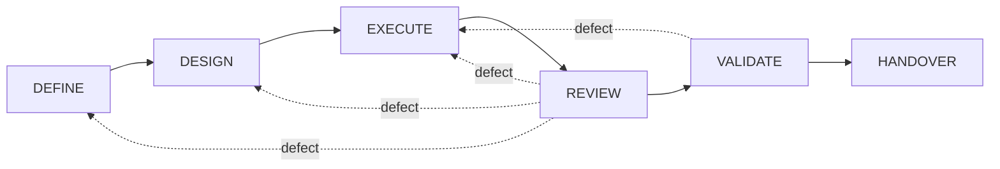

# Universal Autonomous Build Loop

A small, auditable way to let an AI coding agent (Claude, Codex, or any other
agent) build software **without trusting its own word**.

The idea in one sentence: **the AI does the work, a referee checks the work,
and a human makes the decisions.**


## The problem this solves

AI agents can write code, run tests, and say "done". But "done" from the agent
is just a claim. Did the tests really run? Did the agent change files it was
not supposed to touch? Did it quietly loosen the requirements to make its own
job easier?

This repository puts a fixed process around the agent so that every claim is
backed by evidence that the agent did not produce itself.

## How it works, in plain words

Every piece of work goes through the same six steps. No step can be skipped.

| Step | What happens | Who decides it passed |
|---|---|---|
| 1. DEFINE | Turn the request into testable acceptance criteria | The referee checks the criteria are written down |
| 2. DESIGN | Plan the change in small, provable slices | The referee checks the plan is written down |
| 3. EXECUTE | The agent writes the code, one slice at a time | The referee runs your test command and checks which files changed |
| 4. REVIEW | A **second, fresh** agent reads the exact change and gives a verdict | The referee checks the verdict is authentic and passes |
| 5. VALIDATE | The referee runs the acceptance tests again | The referee |
| 6. HANDOVER | The result, the evidence, and the open decisions go to a human | A human |

If a step fails, the work goes back to the step that owns the problem
(a wrong requirement goes back to DEFINE, a wrong plan to DESIGN, a code bug
to EXECUTE). If a decision is missing, the run stops and asks a human. There
are limits on rounds, retries, and wall-clock time, so a run can never spin
forever.



## Who does what

| Role | Job | What it is not allowed to do |
|---|---|---|
| **Agent** (Claude, Codex, …) | Writes the criteria, the plan, the code, the handover notes | Cannot mark its own work as passed |
| **Reviewer** (a fresh agent, ideally a different one) | Reads the exact change and the evidence, returns a verdict | Cannot change any file |
| **Referee** (`engine/reference-engine.sh`) | Runs the test commands, records evidence with checksums, checks which files changed, validates verdicts, moves the state forward | Does not write code |
| **Conductor** (`engine/orchestrator.sh`) | Calls the agent for each step and hands the results to the referee | Makes no pass/fail decisions |
| **Human** | Activates a project, resolves blockers, decides what happens after handover | Cannot be bypassed by any setting |

Merging, releasing, deploying, and touching secrets are always human actions.
The loop stops at HANDOVER.


## What is in the box

| Folder | What it contains |
|---|---|
| `core/` | The fixed workflow and the rules (the contract) |
| `spec/schemas/` | Machine-readable formats for state, evidence, verdicts, and configuration |
| `engine/reference-engine.sh` | The referee |
| `engine/orchestrator.sh` | The conductor: runs one work item through all six steps |
| `engine/render-dashboard.sh` | A one-page HTML dashboard of a run (status, steps, evidence, blockers) |
| `hosts/` | Agent adapters: `claude/` (Claude Code CLI), `codex/` (Codex CLI), `mock/` (for tests) |
| `bootstrap/` | Safe project setup (`init.sh`) and a ready-made trial project (`make-trial-project.sh`) |
| `profiles/` | Starting points for CLI, API, library, docs, desktop, service, automation, and data/AI projects |
| `tests/` | Test suites for the referee, the conductor, the dashboard, and the setup |
| `docs/` | Longer explanations |

The process works for any language or stack. Python, Go, Rust, Java, Node,
or plain documentation: only the configuration changes, never the process.

## Try it in five minutes

You need a Unix-like machine (macOS or Linux) with Bash 3.2+, `jq`, Git,
Perl, and Python 3 for the trial project.

**1. Check the box and run the tests**

```bash
git clone https://github.com/RezaGolriz/autonomous-build-loop-universal-template.git
cd autonomous-build-loop-universal-template
./bootstrap/check-prerequisites.sh
./tests/run-conformance.sh      # the referee   (32 checks)
./tests/run-orchestrator.sh     # the conductor (15 checks, uses the mock agent)
./tests/run-dashboard.sh        # the dashboard (5 checks)
```

**2. Run a real agent on a tiny trial project**

The trial project is a two-file Python package. The task for the agent is to
add a `slugify()` function with tests.

```bash
./bootstrap/make-trial-project.sh ~/textkit-trial
./engine/orchestrator.sh start --root ~/textkit-trial
```

With Claude Code as the agent:

```bash
./engine/orchestrator.sh loop --root ~/textkit-trial \
  --host claude --provider hosts/claude/provider.sh --max-nodes 12
```

With Codex as the agent (set `CODEX_BIN` if `codex` is not on your PATH):

```bash
./engine/orchestrator.sh loop --root ~/textkit-trial \
  --host codex --provider hosts/codex/provider.sh --max-nodes 12
```

Recommended: let one agent build and a different one review. In our trials
this was the fastest and cleanest combination.

```bash
./engine/orchestrator.sh loop --root ~/textkit-trial \
  --host codex  --provider hosts/codex/provider.sh \
  --review-host claude --review-provider hosts/claude/provider.sh --max-nodes 12
```

**3. Look at the result**

```bash
./engine/orchestrator.sh status --root ~/textkit-trial      # JSON summary
./engine/render-dashboard.sh   --root ~/textkit-trial      # writes .loop/dashboard.html
open ~/textkit-trial/.loop/dashboard.html                   # macOS; use xdg-open on Linux
```

The dashboard shows the current step, which gates passed, every piece of
evidence with its result, open blockers, and the work item. It is a plain
static file: no JavaScript, no server, no network.

If the run stopped with a blocker, read `.loop/blockers.md`, tick the box
(`- [x]`), and continue:

```bash
./engine/orchestrator.sh resume --root ~/textkit-trial
./engine/orchestrator.sh loop   --root ~/textkit-trial --host codex --provider hosts/codex/provider.sh
```

## Use it on your own project

```bash
./bootstrap/init.sh /path/to/your/project
```

The initializer looks at your project safely (it reads file names and known
manifest fields, it never runs anything), suggests a configuration, and asks
you to confirm every command, path, and evidence requirement. It writes a
**paused** candidate under `.loop/candidate/` together with an activation
checklist. Nothing runs until you have gone through that checklist and moved
the files to their active names. That is deliberate: the agent must never be
able to activate itself.


Then write your first work item in `.loop/work-items/` (a template is in
`template/work-items/`), and start the loop as shown above.

## What the referee guarantees

- Only commands declared in your configuration are ever run, with a timeout
  and a minimal environment.
- Every command's output is stored with a checksum. Evidence that was edited
  afterwards is rejected.
- Files outside the allowed paths, frozen files, and protected files cannot
  change without failing the step.
- The reviewer gets a one-time challenge code (a nonce). A verdict without the
  right code, or a replayed verdict, is rejected.
- The reviewer never sees the builder's reasoning, only the exact change and
  the evidence.
- State only moves forward through legal transitions. Reaching a limit means
  "blocked", never "passed".

## What it does not do

- It does not merge, release, deploy, migrate data, or read secrets. Those
  stay with you.
- It runs one work item at a time; there is no queue and no parallelism yet.
- It cannot make an agent smart. It makes the agent's work bounded,
  inspectable, and repeatable.

## Status

| Capability | Status |
|---|---|
| Six-step workflow, schemas, referee, test vectors | Implemented and tested |
| Conductor: one work item through all six steps, per-slice path rules, blockers, resume | Implemented and tested |
| Agents: Claude Code CLI, Codex CLI, mock; separate builder and reviewer | Implemented; verified in real end-to-end runs |
| Dashboard | Implemented and tested |
| Safe project setup (`init.sh`) | Implemented and tested |
| Multiple work items, parallel runs | Not yet |
| Delivery (merge, release, deploy) | Deliberately outside the loop |

## More documentation

- [The orchestrator in detail](docs/ORCHESTRATOR.md)
- [Why and how the loop works](docs/AI-DEVELOPMENT-LOOP.md)
- [Step-by-step quickstart](docs/QUICKSTART.md)
- [Architecture and boundaries](docs/ARCHITECTURE.md)
- [Agent adapters and the provider contract](hosts/README.md)
- [Adding profiles and adapters](docs/EXTENDING.md)
- [Bootstrap protocol](bootstrap/README.md)
