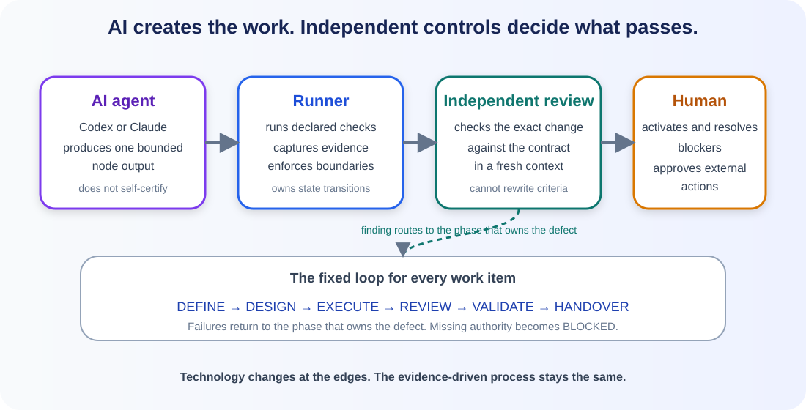
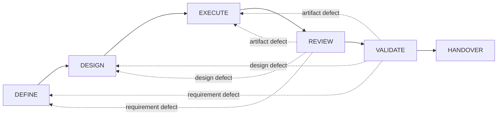
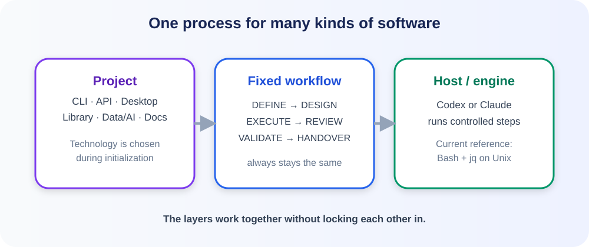
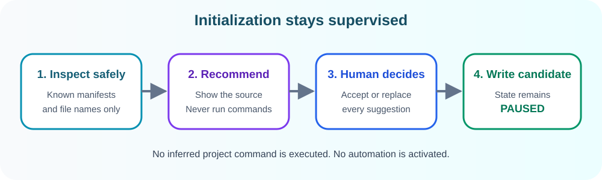

# Universal Autonomous Build Loop

A technology-neutral workflow contract and reference control plane for bounded,
AI-assisted software development with Codex, Claude, or another compatible
agent. The AI produces work, the runner verifies claims, and a human controls
activation and external actions.



## Why this repository exists

AI coding agents can plan, write, test, and review software, but an agent's own
success message is not proof that requirements were correct, the change is safe,
or the result works in the target environment. Without a shared contract, each
agent and technology stack can also drift into a different process.

This repository puts a small, auditable control layer around AI-assisted
development:

- an AI agent produces the output required by one bounded node;
- the runner executes configured checks and records structured evidence;
- the workflow requires a fresh, independent review;
- failed gates return work to the phase that owns the defect;
- missing decisions become visible blockers instead of guesses;
- merge, release, deployment, secrets, and destructive actions remain human
  decisions.

The goal is not to make AI infallible. The goal is to make its work bounded,
repeatable, inspectable, and portable between projects.

## Who does what?

| Role | Responsibility | Boundary |
|---|---|---|
| AI worker — Codex or Claude | Reasons and creates the required artifact for one bounded node | Does not certify its own result or gain authority for external actions |
| Runner / reference engine | Runs declared commands, captures evidence, checks selected path policies, and validates review verdicts | Does not write product code or deploy it |
| Independent reviewer | Examines the exact change, contract, invariants, and evidence in a separate context | Cannot silently change acceptance criteria |
| Human | Activates configuration, resolves blockers, and authorizes external actions | Cannot be bypassed by an autonomy setting |

## How the AI development loop works

A round is one bounded workflow node, not an entire project or an unlimited
agent session. One work item moves through six mandatory phases:

1. `DEFINE` turns the request into testable criteria, constraints, and explicit
   exclusions.
2. `DESIGN` defines boundaries, risks, interfaces, and independently provable
   slices.
3. `EXECUTE` lets the AI worker create the next declared artifact or slice.
4. `REVIEW` requires an independent verdict about the exact durable change.
5. `VALIDATE` requires project-specific acceptance and regression evidence.
6. `HANDOVER` returns the revision, evidence, limitations, and next decision to
   a human.



A successful gate advances the work. A requirement defect returns to `DEFINE`,
a design defect to `DESIGN`, and an artifact defect to `EXECUTE`. Work becomes
`BLOCKED` when a required decision, capability, verifier, or authority is
missing. Round, retry, and wall-clock caps prevent endless self-correction;
reaching a cap produces `BLOCKED`, never success.

Acceptance criteria and out-of-scope clauses are frozen while work is built and
checked. This prevents an AI worker from making its task easier in order to pass
its own gate.



## Who is this template for?

Use this template when you want one clear and auditable development process for
different kinds of projects, including:

- CLI tools, APIs, and services
- desktop applications and automations
- libraries and packages
- data and AI projects
- documentation-only projects

The project may use Python, Java, Go, Rust, C#, C++, Node.js, another
technology, or no programming language at all.

## Technology neutral by construction

Think of a construction project:

- The **construction process** stays the same: clarify, plan, build, inspect,
  test, and hand over.
- The **building materials** may change. In a software project, these are the
  language, runtime, tools, and target platform.
- The **site manager's tools** may change too. The included reference engine
  uses Bash, `jq`, Git, and Perl on a Unix-like system.

A Python CLI and a Java API can therefore use the same process without making
the process itself dependent on Python or Java.

Profiles define the artifacts and evidence a project shape needs. Project
adapters provide languages, runtimes, platforms, commands, and paths. Host
adapters describe the capabilities required from Codex, Claude, or another
executor. These interchangeable edges may depend on the core workflow, but the
core never depends on a language, framework, or agent vendor.

## What version 0.1.0 implements today

The repository distinguishes the complete workflow contract from the smaller
reference implementation that currently enforces selected parts of it.

| Capability | Current status |
|---|---|
| Six-phase workflow and rework rules | Specified |
| Strict schemas and test vectors | Implemented and tested |
| Project profiles | Provided; full profile conformance is not yet tested |
| Safe project discovery and supervised initialization | Implemented and tested |
| Command evidence, snapshots, selected path-policy checks, and timeouts | Implemented and tested |
| Nonce-bound review challenge and verdict validation | Implemented and tested |
| Automatic orchestration of Codex or Claude through the complete state machine | Implemented for a single work item (`engine/orchestrator.sh`, provider-driven) |
| Guaranteed fresh agent context for every node | Implemented: every node and every review is a fresh provider process |
| Merge, release, deployment, migration, or secret access | Deliberately outside the engine |

Today, the template supplies contracts, configuration, safety boundaries, test
vectors, verification building blocks, and an orchestrator that runs one work
item through all six phases with a pluggable provider (mock for tests, Claude
Code CLI, or Codex CLI). See [the orchestrator guide](docs/ORCHESTRATOR.md).
Activation, blockers, and every external action still belong to a human. This
repository is not an unattended AI coding autopilot.

## Try the reference engine in 5 minutes

These steps verify the included control-plane building blocks and create a
`PAUSED` candidate configuration. They do not launch the complete AI loop.

### 1. Get the template and run its checks

The reference implementation needs a Unix-like control host with Git, Bash 3+,
`jq`, Perl, and standard command-line utilities. The prerequisite check lists
anything missing.

```bash
git clone <repository-url>
cd autonomous-build-loop-universal-template
./bootstrap/check-prerequisites.sh
./tests/run-bootstrap-recommend.sh
./tests/run-conformance.sh
```

Replace `<repository-url>` with the HTTPS or SSH URL shown by your Git host.
The recommendation suite checks safe project discovery. The conformance suite
checks the same reference engine against both a Python CLI and a
documentation-only project.

Run initialization only from a clean template checkout. If tracked files are
modified or untracked files are present, the initializer stops because the Git
revision would not identify all code involved in generating the candidate.

The suite also proves that malformed configuration, missing tools, timeouts,
unauthorized file changes, symlink escapes, changed evidence, and illegal state
transitions fail instead of being accepted silently.

### 2. Configure your project

```bash
./bootstrap/init.sh /absolute/path/to/your/project
```

The initializer asks you to choose:

1. the kind of project;
2. the programming language, or `none`;
3. the runtime, compiler, or interpreter;
4. the build, package, and test tools;
5. the platforms, artifacts, and exact verification commands;
6. the evidence required for a successful run.

Before asking, it safely inspects a bounded set of file names and known
manifest fields. It then shows labeled recommendations with their confidence
and basis. Press Enter to accept an ordinary recommendation, or type a
replacement. Suggested command arrays are treated more carefully: the
initializer shows the exact array but accepts it only after you type
`USE-RECOMMENDED`. It never executes a discovered project command.

Supported platforms and the known-failing negative control always require
manual input. If the initializer cannot make a defensible artifact-path or
command recommendation, it asks for one instead of inventing a value.



Example answers for a small project:

| Question | Example answer |
|---|---|
| Project kind | `cli` |
| Language | `Python` |
| Runtime | `CPython >=3.12` |
| Tools | `pytest` |
| Platform | `macos-arm64` |
| Verification command | `["python3","-m","pytest","-q"]` |

> **Important:** The initializer creates configuration files. It does not start
> a loop or enable any automation.

The candidate files are written to the target project:

```text
.loop/candidate/
├── project.adapter.json
├── state.json
├── initialization.answers
├── initialization.provenance.json
└── ACTIVATION-CHECKLIST.md
```

Review the checklist next. The configuration remains `PAUSED` until a human has
confirmed every command, boundary, and evidence requirement.
`initialization.provenance.json` records what was recommended, what was accepted,
and what was entered manually.

## What stays fixed, and what can change?

| Layer | Meaning | Example |
|---|---|---|
| Workflow | The fixed development process | `DEFINE` through `HANDOVER` |
| Project configuration | The project kind and technology | Python CLI, Rust library, documentation |
| Host and engine | Runs controlled steps | Reference engine plus Codex or Claude host specifications |

Dependencies point inward: project and host adapters may use the core contract,
but the core contract does not know any programming language or framework.

## Where are the results?

- `.loop/candidate/` contains configuration that has not been activated.
- `.loop/evidence/` contains structured evidence and captured command output.
- `core/` defines the invariant workflow.
- `profiles/` contains starting points for different project kinds.
- `spec/schemas/` defines the machine-readable file formats.
- `engine/` contains the current reference implementation.

## Deliberate limits

- This template is not an unattended autopilot.
- It cannot guarantee good software. It makes decisions, checks, and evidence
  visible and auditable.
- Version 0.1.0 includes only the Unix-like reference implementation using Bash,
  `jq`, Git, and Perl.
- Publishing, deployment, and irreversible external actions remain outside the
  engine and require explicit human approval.
- Alternative engines may implement the same contracts, but none are currently
  included or enabled automatically.

## More documentation

- [Why and how the AI development loop works](docs/AI-DEVELOPMENT-LOOP.md)
- [Step-by-step quickstart](docs/QUICKSTART.md)
- [Architecture and boundaries](docs/ARCHITECTURE.md)
- [Running the orchestrator](docs/ORCHESTRATOR.md)
- [Adding profiles and adapters](docs/EXTENDING.md)
- [Bootstrap protocol](bootstrap/README.md)
- [Initialization questions](template/INITIALIZATION.md)
