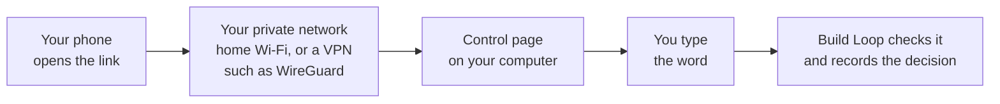

# Control page and dashboard

## The control page

The control page is the easiest way to watch a project and to make the human
decisions. It is one small web page on your own computer that keeps running.
It shows the project's state, plus a **Decisions** panel where you accept a run,
authorize an item, promote a proposal, or put the project on hold and release
it again.

Start it once:

```bash
build-loop serve --root /absolute/project
```

Every start prints a **single-use link** such as
`http://127.0.0.1:43127/?b=…`. It opens the page once, within 10 minutes. Ask
again for a fresh one whenever you need it; starting again returns the same page
instead of a second one. Other commands:

```bash
build-loop serve --root /absolute/project --show-link   # at a terminal only: print the lasting link (?k=…)
build-loop serve --root /absolute/project --rotate      # new key; old links, sessions and unused single-use links stop working
build-loop serve --root /absolute/project --stop        # end the page
```

From chat, `loop_serve` starts the page or returns the running one, and
`loop_dashboard` returns it too when the page is running or when
`.loop/control/policy.json` sets `confirmation_page`. Both hand out single-use
links only; a chat never receives the lasting key. Starting the page decides
nothing: it changes nothing until a person types a word on it.

**How the link works.** When you open a link, the page swaps it for a login
cookie that lasts 12 hours and sends you on to `/`, so the link is no longer
shown in the address bar. That redirect does **not** erase it from your
browser history, and a proxy on the way may have logged it. This is why links
given to a chat are single-use: once opened, or after 10 minutes, such a link
is worthless. The lasting key lives in `.loop/scheduler/control-page.token`
(only you can read it, and `.loop/` is never committed). `--show-link` prints
its link only at an interactive terminal; treat that link like a password, and
use `--rotate` if it may have been seen. Without the cookie every request is
refused. The page keeps its port between restarts, so the lasting link keeps
working as a bookmark.

**The Decisions panel.** When a decision is waiting — because a chat tool asked
for one, or because you pressed a button on the page — the panel shows exactly
what will happen, frozen at the moment it was asked for. You type the word
(`ACCEPT`, `AUTHORIZE`, `PROMOTE` or `RELEASE`) and press the button. Only then
is it recorded, through the same signed receipt as the one-request confirmation
page, with the channel `local-http-user`. When nothing is waiting, the panel
offers: *Accept* (when a handover is ready), *Authorize* an item (scope, rounds,
wall clock and expiry are filled in with the defaults), *Promote* a proposal,
*Release* the hold, and *Hold*. Hold needs no word, because stopping is always
safe. While the page runs, the confirmation links that chat tools return point
to it, and the waiting request appears there.

**Typing the word is not a result.** It records *your decision* — for example
"this item may start" or "I accept this handover". It does not mean the run
succeeded. Success is still a review verdict of `PASS` plus a passed VALIDATE
gate, shown on the same page.

### From your phone



1. Set `confirmation_page` in `.loop/control/policy.json`
   (see [the policy file](CONFIGURATION.md#the-policy-file-who-may-decide-and-from-where)).
2. Restart the page with `--stop` and then `serve`.
3. Open the link on your phone. It now names the address you set, for example
   `http://192.0.2.10:8765/?k=…`.

The phone must be inside your private network: your home Wi‑Fi, or a VPN such
as WireGuard or Tailscale. A VPN is one option, not a requirement. Build Loop
checks the word and the frozen decision, then records it.

**Safety, honestly.** The page is as safe as the local confirmation page, not
more. Anyone inside your private network who has the link can act on it. So keep
the network private, never expose the page to the internet or through port
forwarding, and run `--rotate` if the link may have leaked. Every form also
carries a hidden per-session value and must come from the page itself; at most
ten decisions a minute are taken, and five wrong words lock the field for a
minute. A decision recorded here means "somebody who could reach this page did
it"; it is not proof of who. A project that wants the terminal and nothing else
sets `human_confirmation` to `tty-only`, and the panel then says so and decides
nothing.

To keep the page running after a restart of the computer, install it as a
service: see [Keep the control page running](CONFIGURATION.md#keep-the-control-page-running).

## Other ways to look at the state

The control page is the recommended view. Two older views still work. All three
read the same `.loop/` files.

| View | How to get it | How long it works | Can you decide there? |
|---|---|---|---|
| Control page | `build-loop serve --root …` or `loop_serve` | While its server runs (a stable link) | Yes, by typing the word |
| Short-lived read-only page | `loop_dashboard`, or `build-loop dashboard --root … --json`, when the control page is not running and no `confirmation_page` is set | 30 minutes, then ask for a new link | No, it only shows |
| Static export | `./engine/render-dashboard.sh --root …` (writes `.loop/dashboard.html`; `--output FILE`, or `--output -` to print) | Never expires, but is a snapshot; run it again to refresh | No, it only shows |

The read-only page listens only on `127.0.0.1` and needs the secret in its link.
The static export runs no project command and never touches the network, so you
can open it on any machine; it shows one project per file. Keep both private for
the same reason as the control page: they show paths, work-item text and
evidence. Neither can approve setup or make a decision. The page selectors for
work kind and run mode only prepare text to paste into chat.

## Where the numbers come from

The page is built only from files in the project's `.loop/` folder:

| Section on the page | Source file |
|---|---|
| Header, phase strip, gates | `.loop/state.json` |
| Legal next steps | `.loop/workflow.json` (the fixed workflow) |
| Blockers | `.loop/blockers.md` |
| Evidence table | every `.loop/evidence/*.json` record |
| Work item | `.loop/work-items/<id>.md` |
| Authorization of the current item | `.loop/work-items/<id>.authorization.json` |
| Backlog | `.loop/backlog.json`, plus one `.loop/work-items/<id>.authorization.json` per entry |
| Inbox | `.loop/inbox/index.json` |
| Last tick | the last line of `.loop/scheduler/tick.log` |
| Last scout | the last line of `.loop/scheduler/scout.log` |
| Next-steps memory | `.loop/notes/next-steps.md` |
| Human confirmation mode | `.loop/control/policy.json`, or the default when there is none |
| Project hold banner | `.loop/control/hold.json` |

Nothing is computed from the agent's output or from Git. If a file is
missing, the section says "not available" instead of guessing.

## Reading the page, top to bottom

**Project hold banner.** If `.loop/control/hold.json` exists, a red banner sits
above everything else and says PROJECT ON HOLD, with the recorded reason, when
the hold was placed, which channel placed it, and the work item it was placed
for. While it is there, `start`, `run`, `resume`, `tick`, `task` and `scout` are
refused for every caller that is not a person at an interactive terminal;
reading, `cancel` and `handover` keep working. A person takes the hold off with
`release`: the word RELEASE typed at a terminal or on the local confirmation
page. A hold record that cannot be read is still shown as a hold, because it
still holds. Both dashboards — the Node page and `engine/render-dashboard.sh` —
show the same banner.

**Header.** The work item id, a coloured status badge, the current phase,
`round/max_rounds`, `gate failures/max`, when the state was last updated,
and when the page was generated.

**Execution.** One line says how the run does its node work:
"Execution: separate CLI process (codex) · review: claude", "Execution:
chat-hosted · review: codex", or "Execution: chat-hosted (review not
independently isolated)" when the same chat also reviews. See
[Who does the node work](LOOP-MODES.md#who-does-the-node-work-a-separate-cli-process-or-this-chat).
Job records on the page are observations, not proof that a gate passed.

| Badge | Meaning | What to do |
|---|---|---|
| RUNNING (blue) | The loop is working or waiting for the next `run`/`loop` | Nothing, or keep looping |
| WAITING_FOR_HUMAN (amber) | HANDOVER reached; the run is finished | Read the handover, decide about merge/deploy |
| BLOCKED (red) | A decision is missing or a gate failed hard | Read Blockers, answer, `resume` |
| PAUSED (grey) | Configured but not started | `orchestrator.sh start` |
| COMPLETED / CANCELLED (grey) | Closed by a human | — |

**Phases.** Six pills, one per step. The colour is the gate status: green
passed, red failed, grey not run yet. The current phase has a black outline.
Because a rework can send the work backwards, you may see a red VALIDATE
next to a black-outlined EXECUTE: the validation failed and the work went
back to building.

**Legal next steps.** Which transitions the workflow allows from the current
phase: the normal ("green") next step and the possible rework targets with
their defect class. This is read from the workflow file, so it tells you what
*could* happen, not what will.

**Authorization of the current item.** What a person decided about the item
that is loaded right now: the state (READY or PAUSED), the allowed paths, the
budget in rounds and wall-clock seconds, when the authorization expires, which
channel the decision came through, and whether the item stops at the first
failed gate. READY means "you may start when your slot comes", inside exactly
this scope, budget and expiry. It is never approval of a result and it never
widens the scope of a node.

Three things are called out on this tile:

- An expired authorization is shown as expired, not as READY. Nothing starts
  from it any more; a person has to authorize it again.
- A record that does not validate — a broken `expires_at`, a field the schema
  does not allow — is marked "invalid record · a person has to authorize again".
  It is never shown as READY. An invalid record is a broken decision, not an
  absent one, and nothing starts from it.
- The channel the decision came through is shown as recorded. `interactive-tty`
  is a word typed at a terminal and `local-http-user` is the same word typed on
  the local confirmation page; those are the two ways a person can decide.
  `cli-input` and `mcp-user` are older records from transports that today may
  only *ask* for a confirmation, and `mcp-user` is still marked "authorized
  through a chat tool call".
- The **assurance** is shown next to it. `local-user-action` means a person with
  access to this machine typed the word. It is not proof of who that person was:
  the confirmation page is served on loopback, so an agent with shell access on
  the same computer could in principle open it. The tile also names the
  project's confirmation mode — `tty-or-local-page` by default, or `tty-only`
  when `.loop/control/policy.json` says so and the local page is refused
  altogether.

If the item has no sidecar file, the tile says "not available": nobody has
authorized anything, and only a person can write that record.

**Backlog.** The queue behind the current item, with the count of READY and
PAUSED entries and one row per item: id, title, work kind, authorization state
and expiry. An entry whose authorization has run out is counted as PAUSED and
marked expired; an entry whose record does not validate is counted as PAUSED and
marked "invalid record". Nothing in this list starts on its own. A PAUSED item waits for
a person; a READY item waits for its slot, which a `tick` may give it inside its
recorded budget.

**Inbox.** Proposals a scout wrote, with id, title, when they were created and
which provider suggested them. A proposal is inert: it is a piece of text, not
queued work, and it becomes work only when a person promotes it into the
backlog. Without an inbox index the tile says "not available".

**Last tick and last scout.** The last line of the tick log, split into the
time, the action (`ran-node`, `started`, `reported`, `nothing`,
`replaced-stale-lock`), the reason, and the item, phase and run status at that
moment; then the last scout entry with its time, status, number of proposals,
provider and profile. Reasons worth reading are `authorization-revoked`,
`authorization-expired` and `authorization-invalid`, which all mean the cadence
stopped because the decision behind it no longer holds. These are log entries
about what a trigger did. They are not gate results, and a tick may only ever do
what a person authorized before.

**Next-steps memory.** The advisory note the last run wrote at HANDOVER
(`.loop/notes/next-steps.md`), folded away until you open it. It summarises the
run and suggests priorities, and the next DEFINE brief and every scout brief
carry it along. It approves nothing and widens no scope. Missing note, no
guessing: the tile says "not available".

**Blockers.** Open questions first (`- [ ]`, red), resolved ones after
(`- [x]`, grey). Each line names the phase and the run id it came from.

**Evidence.** One row per evidence record, newest first:

- *ID* — for example `run-WI-001-2-execute-build-check`. Read it as
  `run-<work item>-<round>-<phase>-<command>`. `review-…` rows are review
  verdicts checked by the referee; `…-orchestrator` rows are the conductor
  confirming that a text-only phase (DEFINE, DESIGN, HANDOVER) produced its
  section.
- *Type* — `command` (a command ran), `behavior`, `acceptance`, `contract`,
  `artifact`, `installation` (what a command was declared to prove),
  `independent-review`, `contract`/`documentation` (the text phases).
- *Result* — PASSED, FAILED, or BLOCKED.
- *Producer* — `reference-engine` (the referee ran it) or `orchestrator`.
- *Command details* — command id, exit code, and duration for `command` rows.

A count per result closes the table. A run with a few FAILED rows is
normal: they are the rework loops. What matters is that the **gates** are
green at the end.

**Gates.** The six phases again, with the evidence ids that closed each
gate. Click nothing; copy an id and open
`.loop/evidence/<id>.json` to see the full record, or
`.loop/evidence/<run-id>/logs/` for the raw command output.

**Work item.** The whole work-item file, folded. Open it to read the
acceptance criteria the agent wrote, the slices, and the handover notes.

## Digging deeper than the page

The page is a summary. The truth lives next to it:

```text
.loop/evidence/
├── run-WI-001-2-execute-build-check.json        # one evidence record
├── review-run-WI-001-2-execute.json             # the referee's review record
└── run-WI-001-2-execute/
    ├── run-summary.json                          # what the referee did in that step
    ├── logs/build-check.stdout                   # raw output of your test command
    ├── logs/build-check.stderr
    ├── logs/provider.stdout                      # what the agent returned
    └── logs/provider.stderr                      # what the agent wrote to stderr
```

Every record carries the Git revision it was made at and a checksum of the
logs it refers to. If someone edits a log afterwards, the referee rejects the
record.
