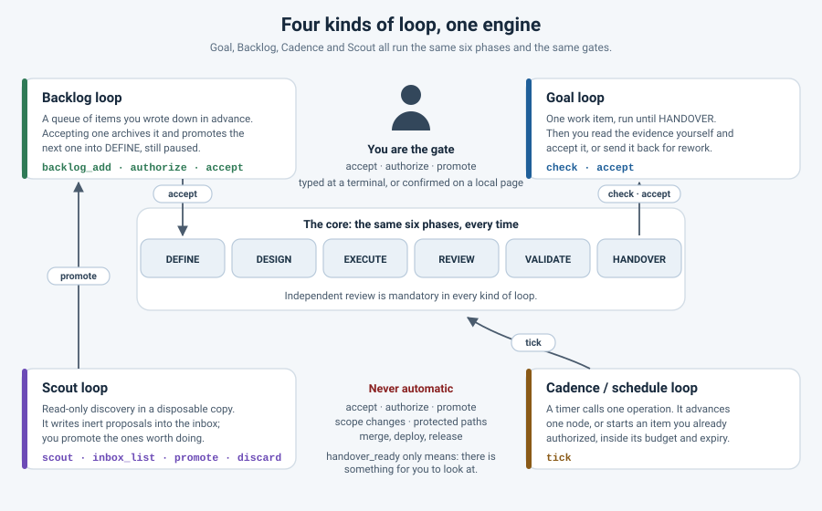

# Loop kinds and run modes

There are four ways to run Build Loop. All four use the same engine, the same
six phases and the same gates. What changes is who decides *when* the next
piece of work starts, and where the work comes from.



## The four kinds

| Kind | What it is for | Operations |
|---|---|---|
| **Goal loop** | One work item, carried to HANDOVER. You read the evidence and decide. | `check`, `accept` |
| **Backlog loop** | Several items in a written order. Accepting one promotes the next. | `backlog_add`, `backlog_list`, `authorize`, `accept` |
| **Cadence / schedule loop** | A timer calls one operation again and again, inside limits you wrote down. | `tick` |
| **Scout loop** | Discovery: what is worth doing here at all? Proposals land in an inbox. | `scout`, `inbox_list`, `promote`, `discard` |

Step-by-step walkthroughs on real example projects:
[docs/examples/loops/README.md](examples/loops/README.md).

They combine. A normal week is: a scout run once in a while, a backlog you
promote into and prune, an authorization for the one item you want moved, and a
cadence that moves it a node at a time while you do something else.

### Goal loop

Prepare one work item, start it, let it run to HANDOVER, then look. `check`
answers "where does this stand" in one read-only call, and `accept` archives the
finished run. Nothing else happens on its own.

### Backlog loop

`.loop/backlog.json` holds an ordered list; each entry names a work item file
under `.loop/work-items/`. `backlog_add` writes that file from the shipped
template and appends the entry — it starts nothing. `accept` archives the
finished run into `.loop/history/<item>-<timestamp>/` and promotes the next
entry into a fresh `state.json`: PAUSED, phase DEFINE, round 0. Promotion is
not a start; a person still starts it, or authorizes it so a tick may.

### Cadence / schedule loop

`tick` is one small step for a timer. It reports while a job is running, it
advances one node of a running item, it reports a blocked run and a run waiting
for a person with a passed HANDOVER gate, and it starts an item **only** when a
person already authorized that item as READY and the authorization has not
expired. Otherwise it does nothing. A run that is waiting for a human while the
HANDOVER gate is still PENDING has not written its handover yet: that is work,
not a wait, so the tick runs that node too. Continuing is bound to the same
decision as starting — if the item has an authorization sidecar it has to be
READY and unexpired at the moment of the launch, otherwise the tick reports
`authorization-revoked`, `authorization-expired` or `authorization-invalid`; a
run a person started by hand has no sidecar and may continue. Every tick appends
one line to `.loop/scheduler/tick.log`, and two ticks cannot overlap.

The client incantations — Claude Code `/loop` and `/schedule`, Codex
Automations, `cron` — are in
[ADVANCED.md](ADVANCED.md#running-on-a-cadence) and in
[the cadence walkthrough](examples/loops/cadence.md). Slash-command syntax
changes between client releases; check the client's own documentation if one of
them is not recognised.

### Scout loop

`scout` sends the configured provider once through a **disposable copy** of the
project with read-only tooling, a clean environment and an isolated home
directory. Only a bundled provider wrapper is ever executed — the one shipped
for that host, or the one `configure` generated around it — because a program
started with your own privileges can write to any absolute path whatever its
working directory is; containment rests on those wrappers selecting read-only
tooling, together with the copy. The scout writes proposals into `.loop/inbox/`
and never touches the backlog, the state or a run. A proposal is text until a
person confirms `promote`.

## Run modes

`run_mode` says how much of the loop one call executes. It is independent of
which kind of loop you are running.

| `run_mode` | Nodes executed |
|---|---|
| `step` | at most 1 node |
| `bounded` | at most `max_nodes` nodes, default 12 |

`max_nodes` may be set explicitly in the range 1..500. Combining
`run_mode: "step"` with `max_nodes` greater than 1 is a conflict and is
rejected. Neither mode is unlimited, and neither starts an independent new
workflow — both advance the current work item only. Finishing the nodes of a job
means *that job* finished; handover is a separate, explicit event.

`start`, `run` and `resume` all accept `run_mode`:

```json
{
  "request_id": "2026-09-07-wi1042-01",
  "run_mode": "bounded",
  "max_nodes": 12
}
```

```json
{
  "request_id": "2026-09-07-wi1042-02",
  "run_mode": "step"
}
```

**`request_id` rules.** Each distinct request needs its own unique
`request_id`. Re-sending the same `request_id` with the same arguments is an
exact retry and returns the original result instead of starting new work. After
a dropped connection, call `status` with the returned `job_id` (or no argument
for the current job) rather than issuing a fresh one — that is what prevents
duplicate runs.

An `autonomy` field exists, but it does not reliably select the operational run
mode. Always set `run_mode` explicitly.

In the Bash orchestrator the same bounds have different names:
`orchestrator.sh run` executes one node, `orchestrator.sh loop --max-nodes 12`
executes up to twelve nodes of the same work item. See
[the shell guide](SHELL-ORCHESTRATOR.md).

## Work kinds

`work_kind` says what kind of work item this is. Pass it to `prepare` for the
first item, to `task` after a completed handover, or to `backlog_add` and
`promote` for a queued one.

| Choice | Value | Focus |
|---|---|---|
| Feature | `feature` | New behavior and regression coverage |
| Bug fix | `defect` | Reproduce the failure and verify the fix |
| Refactoring / maintenance | `maintenance` | Preserve behavior and compatibility |
| Documentation | `documentation` | Reader needs, examples and links |
| Research | `research` | Evidence, alternatives and limitations |
| Migration preparation | `migration` | Compatibility, rollback and disposable rehearsal |

`feature` is the default. The kind selects the guidance the worker receives. It
does **not** write acceptance criteria for you and it unlocks no shortcut past
verifiers or review: every kind runs the same six phases and the same mandatory
independent review.

- `research` produces a report. The report is reviewed and validated like any
  other output — it is not exempt.
- `migration` covers **preparation only**. A migration run has no authority over
  live systems: it plans, writes and verifies migration material.

To choose visually, ask chat to show [the dashboard](DASHBOARD.md). Its
selectors generate a request to use in chat and never change a running item.

## What is never automatic

However many loops you stack on top of each other, these stay human decisions:

- **Accepting a result.** `accept` needs the literal word `ACCEPT`.
- **Authorizing an item to start.** `authorize` needs the literal word
  `AUTHORIZE`, and it is a permission to *start*, never approval of a result.
- **Promoting a scout proposal** into the backlog. `promote` needs the literal
  word `PROMOTE`.
- **Changing the scope** of a work item, or the allowed paths of a run.
- **Starting an item whose authorization was withdrawn.** A sidecar in state
  PAUSED means a person has to act. `start`, `run` and `resume` are refused with
  `AUTHORIZATION_REVOKED` — from a chat tool call, an input file, a cadence tick,
  a schedule, whatever asks. Only a person at their own terminal can still run
  it, and even then the record's paths and budget still bound the run. An item
  with no authorization record at all is a manual item and is unaffected.
- **Taking a project-wide hold off.** `deauthorize` also puts the whole project
  on hold, and anybody may put one on deliberately with `hold`. While
  `.loop/control/hold.json` exists, `start`, `run`, `resume`, `tick`, `task` and
  `scout` are refused with `PROJECT_ON_HOLD` for everything that is not a person
  at their own terminal, so writing a new work item is no way around a withdrawn
  decision. `cancel` and `handover` keep working, because stopping is always
  allowed. Only `release`, with the literal word `RELEASE`, takes the hold off.
- **Protected paths.** The worker cannot change them to make its own checks pass.
- **Merging, pushing, deploying, releasing, flashing a device, running a
  migration, or any other external action.**

A timer, a note, a next-steps memory and a judge verdict are all inputs. None of
them is an approval, and nothing in the loop reads a decision out of them.

### How those decisions are made

Only two routes complete `accept`, `authorize`, `promote` or `release`:

1. **The word typed at an interactive terminal.** `build-loop accept --root …`
   prints what is about to happen and waits for `ACCEPT`. The record keeps the
   channel `interactive-tty`.
2. **The same word typed into the field on a local confirmation page.** Every
   other transport — a `--input` file on the command line, an MCP tool call from
   a chat client — completes nothing, whatever word it passes. The call returns

   ~~~text
   {"ok": true, "pending_confirmation": true, "request_id": "confirm-…",
    "request_digest": "…", "confirmation_word": "AUTHORIZE",
    "confirmation_url": "http://127.0.0.1:…/confirm?token=…"}
   ~~~

   When the request is made, the whole decision is **frozen**: the operation,
   the item, every argument including the defaults it inherits, and a
   fingerprint of the thing being decided about — the exact authorization record
   that would be written, the run and its HANDOVER evidence for an acceptance,
   the sha256 of the proposal file for a promotion. The page displays exactly
   that frozen decision. Nothing is written until a person types the word into
   the field and presses the button; the record then keeps the channel
   `local-http-user`. The request expires after fifteen minutes, and repeating
   the same call hands out the same link rather than a second one.

   The receipt signs the request id together with a digest of the frozen
   request. Before the decision is carried out, that digest is recomputed from
   the frozen request on disk, the request is claimed by an atomic rename so
   that two settlements cannot run it twice, and the runner re-checks the live
   item under the lock in which it does the work. Anything that no longer
   matches — a widened record, a copied receipt, a run that moved on, a proposal
   that was rewritten — is refused with `CONFIRMATION_STALE` and the request is
   thrown away.

An assistant must give that link to the person and never open or submit it
itself. If the page is closed after the word was typed but before the operation
ran, the receipt it left behind is settled by the next `accept`, `authorize`,
`promote`, `release` or `tick` call.

### What the assurance is worth, and how to demand more

Both routes record the assurance `local-user-action`: somebody with access to
this machine typed the word. That is what it says and no more. The confirmation
page is served on loopback, so an agent that already has shell access on the
same computer could in principle open the link and type the word too. The page
says so itself.

If you need a hard guarantee, write this file by hand:

~~~json
{"schema_version": 1, "human_confirmation": "tty-only"}
~~~

as `.loop/control/policy.json`. No operation writes or edits it, and in
particular no MCP tool call can: it is yours. With `tty-only`, `accept`,
`authorize` and `promote` from a chat tool call or an `--input` file are refused
with the error `CONFIRMATION_TTY_ONLY` and the exact command for you to run;
only the word typed at an interactive terminal decides. The command holds the
complete decision, shell-quoted, for example

~~~text
build-loop authorize --root '/path/to/project' --input '{"item_id":"WI-007","allowed_paths":["docs/guide.md"]}'
~~~

so nothing has to be typed again and nothing quietly falls back to the current
item; your terminal still asks you to type `AUTHORIZE`. A confirmation page that
was still open when you wrote the file is thrown away rather than carried out.
A policy file that does not match its schema — a misspelled key, a null value,
an unknown mode, a wrong version — is refused with `INVALID_POLICY` instead of
falling back to the permissive default, and until you repair it the project
behaves as `tty-only`, so you can repair it from your own terminal. The default is
`tty-or-local-page`. `status` reports the mode under `human_confirmation`,
`check` reports it as a single field, both report the error itself under
`policy`, and both dashboards show it.

## `handover_ready` is not success

`check` returns `handover_ready: true` when the run is `WAITING_FOR_HUMAN` and
the HANDOVER gate passed. That means **there is something for you to look at**.

Verified success is something else: a recorded REVIEW verdict of `PASS`
together with a passed VALIDATE gate. `check` reports the verdict separately as
`judge_verdict` so the two are never confused, and repeats the rule in its
`verified_success_requires` field. A handover with `judge_verdict` set to
`FAIL` is a finished run that did not succeed.

## The authorization record

A work item may have a sidecar next to it,
`.loop/work-items/<id>.authorization.json`. It has two states: **PAUSED** means
the item is inert and nothing may start it without a person; **READY** means a
person already said "this one may run when its slot comes", under written-down
limits.

| Field | In plain words |
|---|---|
| `item_id` | Which work item this decision is about. |
| `state` | `READY` (may start when its slot comes) or `PAUSED` (inert). |
| `scope.allowed_paths` | The only paths a run of this item may change. |
| `budget.max_rounds` | How many workflow rounds it may use before it stops. |
| `budget.max_wall_seconds` | How long it may take in wall-clock time. |
| `expires_at` | After this moment the permission is gone. Nothing starts from it. |
| `stop_on_first_failure` | If true, a failed gate blocks the item instead of retrying. |
| `authorized_by` | Which channel the decision came through: `interactive-tty` for a word typed at a terminal, `local-http-user` for a button pressed on the local confirmation page. `cli-input` and `mcp-user` are transports that may only *ask* for a confirmation. |
| `authorized_at` | When the person decided, as an RFC 3339 timestamp. |
| `assurance` | `local-user-action`: a person with access to this machine typed the word, at the terminal or on the local confirmation page. It is not proof of who that person was. |
| `note` | Optional free text from the person. |

`authorize` writes it with an expiry 24 hours ahead and `stop_on_first_failure`
set to true unless you choose otherwise. `deauthorize` sets the state back to
PAUSED and puts the whole project on hold, so a new work item is no way around
the withdrawn decision; a person takes that hold off with `release`. Starting a READY item copies its budget into `state.json` and records
the authorization in `.loop/control/current-job.json`; that happens wherever the
item is actually started — `start`, and `run` or `resume` on a paused item — and
it never resets rounds already used or time already elapsed. Continuing a run
that is already going — `run` on a RUNNING item, `resume` on a BLOCKED one —
takes the **smaller** of the current cap and the authorized cap, so a fresh
authorization can narrow a run but never widen one in flight. An expired
authorization is refused rather than ignored, and a sidecar that cannot be read
or does not validate refuses `start`, `run`, `resume`, `tick` and every job with
`AUTHORIZATION_INVALID` until a person repairs or deletes it.

`scope.allowed_paths` is an **outer boundary**, not a second slice table. After
DESIGN, every path the slice table declares has to be covered by it, or the
DESIGN gate fails; after EXECUTE and VALIDATE, every changed file outside
`.loop/` has to be covered as well, or the run is BLOCKED with evidence naming
the path. A slice may narrow the authorized scope; it can never reach outside it.

A job running under an authorization re-reads it before every node. Withdrawing
it, or letting it expire, stops the job at the next node boundary, and with
`stop_on_first_failure` a failed gate stops it too, leaving the run BLOCKED with
the blocker line "stopped on first failure (authorization)".

A record that does not validate — an `expires_at` that is not a real RFC 3339
timestamp, for example — is not a weaker authorization but an **invalid** one.
`status`, `check` and the dashboard report its state as `INVALID`, nothing ever
starts from it, and a person has to write it again. The schema is
[spec/schemas/authorization.schema.json](../spec/schemas/authorization.schema.json).

## The next-steps memory

When a run reaches HANDOVER the loop writes one small note,
`.loop/notes/next-steps.md`: the work item and run ids, a summary of the rounds
and gate results, three priorities read out of that evidence, the first item
waiting in the backlog, and the evidence ids of the last round.

The note is **advisory**. The next DEFINE brief and every scout brief carry it
along, so the next cycle starts from what the last one saw. It approves nothing,
widens no scope, and `accept` copies it into history rather than acting on it.

## Blockers, rework and slices

- When the loop raises a blocker question, record the human's actual response
  with `answer` / `loop_answer` — it writes the structured sidecar — and then
  `resume`. The same `run_mode` rules apply to the resumed run.
- `pause` requests a pause and `cancel` requests cancellation at the next node
  boundary. Activation jobs cannot be paused or cancelled this way.
- A failed gate normally means rework: the work goes back to an earlier phase
  and the round counter climbs. Rework rows in the evidence table are normal;
  what matters is that the gates are green at the end.
- Worker edits stay inside the current execution slice's allowed paths. A slice
  is how a work item is cut into pieces the referee can check one at a time.
- Start a new task only after the previous handover has been acknowledged. Do
  not overwrite loop state or edit run metadata directly; change it through the
  operations.

## Review and mock mode

For review you can use the same provider in a fresh, independent review session,
or a different provider entirely. Both satisfy the independent-review
requirement; neither lets a run review itself in place.

Mock mode replays **known fixtures only**. It does not implement arbitrary
projects, so a passing mock run is not evidence that a real project works. The
mock provider also answers the SCOUT phase with two fixed proposals, which is
what the scout tests use.

## Cheat sheet

`OP` is the same word in all three places: the CLI takes
`build-loop OP --root PATH`, MCP exposes it as `loop_OP`, and the operation
catalog in `control/schemas.mjs` is the single list. Below, `…` after `--root`
stands for the absolute path to your target-project folder.

| I want to… | In chat | On the command line |
|---|---|---|
| Know where this stands | "Run a build-loop check and tell me the run status, the phase, the judge verdict and the next action." | `build-loop check --root … --json` |
| Run one node | "Continue for one step and show me the result." | `build-loop run --root … --input '{"request_id":"r-01","run_mode":"step"}'` |
| Run a bounded stretch | "Continue in bounded mode for at most 12 nodes, then stop." | `build-loop run --root … --input '{"request_id":"r-02","run_mode":"bounded","max_nodes":12}'` |
| Write down the next item | "Add a backlog item titled … with this outcome: …" | `build-loop backlog_add --root … --input '{"title":"…","outcome":"…","work_kind":"feature"}'` |
| See the queue | "List the backlog with the authorization state of each item." | `build-loop backlog_list --root … --json` |
| Let one item start later | "Authorize WI-002 for src and tests, 20 rounds, 1800 seconds, expiring in 8 hours." — then open the confirmation link it returns | `build-loop authorize --root …` then type `AUTHORIZE` |
| Take that permission back | "Deauthorize WI-002." | `build-loop deauthorize --root … --input '{"item_id":"WI-002"}'` |
| Stop everything now | "Put this project on hold: …" | `build-loop hold --root … --input '{"reason":"…"}'` |
| Let it continue | "Release the hold." — then open the confirmation link it returns | `build-loop release --root …` then type `RELEASE` |
| Move it on a timer | "Call tick and tell me the action and the run status." | `build-loop tick --root …` |
| Look for work | "Scout this project and show me what came back. Do not promote anything." | `build-loop scout --root … --input '{"provider":"claude"}'` |
| Read the proposals | "List the inbox." | `build-loop inbox_list --root … --json` |
| Turn a proposal into work | "Promote that proposal into the backlog as a defect." — then open the confirmation link it returns | `build-loop promote --root … --input '{"proposal_id":"P-…"}'` then type `PROMOTE` |
| Throw a proposal away | "Discard that proposal." | `build-loop discard --root … --input '{"proposal_id":"P-…"}'` |
| Accept a finished run | "I have read the handover. Accept it with this note: …" — then open the confirmation link it returns | `build-loop accept --root …` then type `ACCEPT` |
| See everything at once | "Show me the build-loop dashboard." | `build-loop dashboard --root … --json` |

Keep user-facing prompts in ordinary language. Describe the work plainly; the
mode fields carry the control settings.
