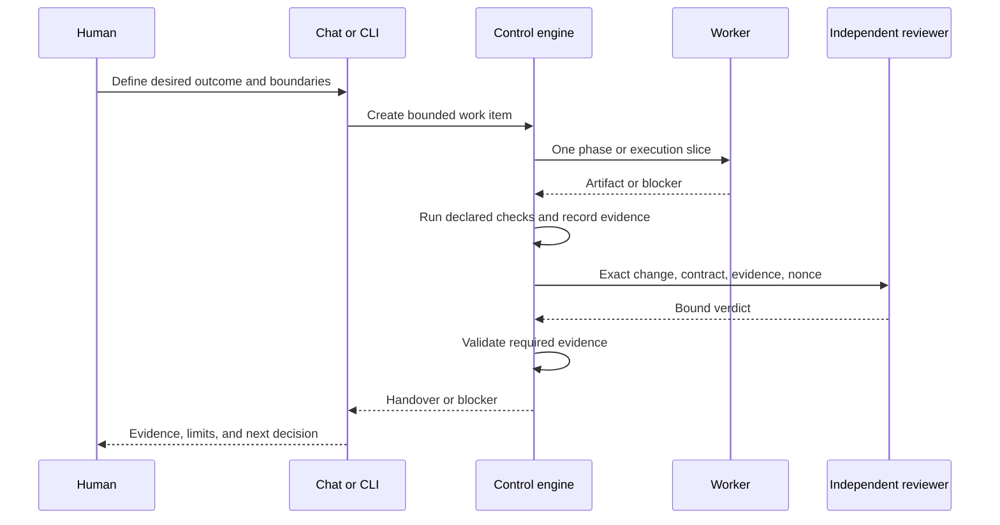

# Quick start

This guide covers four ways to use Universal Build Loop: Codex, Claude Desktop,
the Node.js CLI, and the shell scripts. They share the same contract and project
adapter.

## Before you begin

Keep these requirements separate:

| Layer | Requirement |
|---|---|
| Control engine | Node.js 22 or newer for the CLI and MCP server, plus Bash 3.2+, `jq`, Git, Perl, and standard Unix tools used by the reference controls |
| Target project | Its own compiler, interpreter, package manager, test tools, browsers, devices, or services |
| AI provider | An installed and separately authenticated Claude Code or Codex CLI when that provider is selected |

Claude Desktop supplies Node for a local extension, but it does not install,
configure, or authenticate the worker CLI. Universal Build Loop does not install
target dependencies or create provider accounts.

The current implementation targets macOS and Linux; consult the validation
matrix for environments actually tested. Native Windows is unsupported and
unvalidated because the control path depends on Bash, Unix tools, and Unix
process behavior.

## Option A: start in Codex

First [install the bundled Codex plugin](../hosts/README.md#install-the-codex-plugin)
and start a new Codex task so the skill is loaded. Opening an unrelated target
does not discover a skill that exists only in the Universal Build Loop package.
Open the target repository as the new task's current project, then inspect it and
check local prerequisites:

> Inspect this project for the Universal Build Loop and check its prerequisites.
> Do not execute project commands, write configuration, or activate the loop.

Then provide the first bounded request:

> Prepare the initial work item for [specific outcome]. Keep [invariant]
> unchanged. Show the exact commands, protected paths, evidence requirements,
> provider choices, and negative control. Do not run project commands.

Preparation creates the initial work item and setup proposal together. Review
the result and correct any inferred value that is not true for the target.
Codex may call request-approval and show you the local URL. You must open that
URL and press Approve yourself. The model must never fetch the URL, submit the
approval form, or treat chat text as the approval action. After activation, ask
Codex to start the prepared item. Long work returns a job ID; keep it for a
later chat.

## Option B: start in Claude Desktop without a terminal

[Install the included Claude Desktop local extension](../hosts/README.md#install-the-claude-desktop-extension)
and select the target project when prompted. The extension starts a
project-bound stdio MCP server; the server cannot switch to another project root
during the conversation.

Open a new Claude Desktop conversation and use the same two prompts shown for
Codex: first inspect and doctor, then provide the initial bounded request.
Claude should show the setup proposal and call the no-argument
loop_request_approval tool. Open the returned local link yourself and press
Approve. Claude must not open or submit the approval URL on your behalf.

Plainly opening the repository files in Claude Desktop, or adding only
`CLAUDE.md`, gives Claude instructions but no executable bridge. The local
extension or an equivalent MCP configuration is required for Claude Desktop to
inspect control state, create jobs, answer blockers, or resume work.

When the desktop window closes, an in-progress bounded job remains represented
by its durable job ID. Reopen the project connection, ask for status, and
provide the job ID if the client does not restore it automatically.

## Option C: use the Node.js CLI

### Run the local demonstration

The packaged docs include input files for a small documentation fixture. From
the package root:

```bash
demo_root="$(mktemp -d)"
node bin/build-loop.mjs demo --root "$demo_root" \
  --input docs/examples/demo-docs.json --json
node bin/build-loop.mjs request-approval --root "$demo_root" --json
```

Open the returned confirmation_url in your browser and press Approve. This
human browser action is required. In a directly operated interactive terminal,
the CLI-only alternative is
`node bin/build-loop.mjs approve --root "$demo_root"`; review the displayed
scope and type the literal `APPROVE`. An agent must not supply either approval.

Then start asynchronous activation:

```bash
node bin/build-loop.mjs activate --root "$demo_root" --json
node bin/build-loop.mjs status --root "$demo_root" --json
```

activate returns immediately with a durable job. Repeat status until
job.operation is activate, job.status is COMPLETED, initialized is true,
state.run_status is PAUSED, and activation.valid is true. If job.status is
FAILED, inspect job.last_error and job.activation_result; do not start the work
item.

After successful activation, start the prepared work:

```bash
node bin/build-loop.mjs start --root "$demo_root" \
  --input docs/examples/start-demo.json --json
node bin/build-loop.mjs status --root "$demo_root" --json
```

start also returns immediately with a durable job. Repeat status until the job
is no longer QUEUED or RUNNING. When canonical state is waiting at a passed
HANDOVER, acknowledge the local result:

```bash
node bin/build-loop.mjs handover --root "$demo_root" \
  --input docs/examples/handover-demo.json --json
```

The demo writes a fixture, paused candidate, and local deterministic provider in
the selected empty directory. It runs no target command until you approve and
activate its probes. It performs no publication or deployment.

### Prepare an existing project

From the Universal Build Loop package or repository, inspect first:

```bash
node bin/build-loop.mjs inspect --root /path/to/target --json
node bin/build-loop.mjs doctor --root /path/to/target --json
```

Preparation is non-executing. Save a reviewed request as prepare.json. This
example assumes the target already has an authoritative scripts/verify-docs.sh
command; replace it with facts from your project.

```json
{
  "request": "Clarify the installation guide.",
  "acceptance_criteria": [
    "The guide distinguishes control, target, and provider prerequisites.",
    "The existing documentation verifier passes."
  ],
  "out_of_scope": ["Publishing the documentation"],
  "allowed_paths": ["docs/**"],
  "negative_control": {
    "argv": ["sh", "scripts/verify-docs.sh", "--fixture", "missing"],
    "cwd": ".",
    "timeout_seconds": 60,
    "expected_exit_code": 2,
    "expected_output": {
      "stream": "stderr",
      "match": "includes",
      "value": "missing fixture"
    }
  }
}
```

```bash
node bin/build-loop.mjs prepare --root /path/to/target \
  --input /path/to/prepare.json --json
```

`inspect` and `prepare` do not execute target commands. `--json` pretty
prints the JSON result; without it, the CLI emits compact JSON. Preparation
should identify:

- the proposed project profile and target technologies;
- exact argument-vector commands with working directories and timeouts;
- expected artifacts and evidence kinds;
- allowed environment variable names;
- protected paths and external-effect boundaries;
- a meaningful positive probe and a known-failing negative probe;
- proposed builder and independent reviewer providers.

The approval and activation operations use the prepared server-side proposal,
so neither takes an input file:

```bash
node bin/build-loop.mjs request-approval --root /path/to/target --json
node bin/build-loop.mjs activate --root /path/to/target --json
```

After opening the returned local URL and approving it, activation starts a
durable asynchronous job. Poll status until job.operation is activate,
job.status is COMPLETED, initialized is true, state.run_status is PAUSED, and
activation.valid is true. Activation validates project configuration and runs
the approved positive and negative probes in a disposable copy. The negative
probe must fail through the same verification boundary. A missing verifier
permits planning only.

The initial work item is created by prepare. Start it directly with start.json,
which contains a client request ID and explicit node bound:

```json
{
  "request_id": "request-001",
  "max_nodes": 8
}
```

Then run:

```bash
node bin/build-loop.mjs start --root /path/to/target \
  --input /path/to/start.json --json
node bin/build-loop.mjs status --root /path/to/target --json
```

After that item reaches a passed handover and you acknowledge it, task creates
the next work item. work-item.json uses this shape:

```json
{
  "request": "Clarify the upgrade guide.",
  "acceptance_criteria": [
    "The guide explains the supported upgrade path."
  ],
  "out_of_scope": ["Publishing the documentation"],
  "allowed_paths": ["docs/**"],
  "work_item_id": "WI-002"
}
```

```bash
node bin/build-loop.mjs task --root /path/to/target \
  --input /path/to/work-item.json --json
```

Keep input files free of secrets. Project commands inherit only allowed
environment variable names, and secret values must remain in the provider or
target's established secret mechanism.

## Option D: keep using the shell scripts

The shell path is a first-class entry point for compatible Unix environments:

```bash
./bootstrap/check-prerequisites.sh
./tests/run-conformance.sh
./tests/run-orchestrator.sh
```

Try a preconfigured disposable project:

```bash
./bootstrap/make-trial-project.sh /tmp/textkit-trial
./engine/orchestrator.sh start --root /tmp/textkit-trial
./engine/orchestrator.sh loop --root /tmp/textkit-trial \
  --host codex --provider hosts/codex/provider.sh --max-nodes 12
./engine/render-dashboard.sh --root /tmp/textkit-trial
```

For a real project, run `./bootstrap/init.sh /path/to/target`. It writes a
paused candidate under `.loop/candidate/`; it never activates the project or
runs discovered commands. Follow [the bootstrap protocol](../bootstrap/README.md)
before copying candidate files to their active names.

## A typical work-item flow



If a required decision is missing, the run becomes `BLOCKED`. Read the
blocker, provide one scoped answer, then resume:

```bash
node bin/build-loop.mjs answer --root /path/to/target \
  --input /path/to/blocker-answer.json --json
node bin/build-loop.mjs resume --root /path/to/target \
  --input /path/to/resume.json --json
```

blocker-answer.json contains an answer plus exactly one blocker_id or
blocker_index. resume.json contains a new project-unique request_id and a
max_nodes bound. Reuse a request ID only for an exact retry of the same operation
and bound; conflicting reuse returns REQUEST_ID_CONFLICT.

Pause a running build job before changing its configuration. The request is
deferred until the current node boundary. While it waits, status reports
observed_status as STOPPING; job status becomes PAUSED at the boundary. A pause
does not mark a gate passed or discard durable evidence. Activation jobs cannot
be paused or cancelled; the API returns ACTIVATION_NOT_STOPPABLE.

To cancel work, call cancel and poll status until both the job and canonical
state are CANCELLED. Then call handover with a note acknowledging the
cancellation. This records the decision and changes canonical state to COMPLETED
without delivery. task can create the next work item after that acknowledgement.

```json
{
  "note": "Cancellation acknowledged. No delivery action is authorized."
}
```

```bash
node bin/build-loop.mjs cancel --root /path/to/target --json
node bin/build-loop.mjs status --root /path/to/target --json
node bin/build-loop.mjs handover --root /path/to/target \
  --input /path/to/cancellation-handover.json --json
```

## Verify the result

At handover, inspect:

- the active work-item contract and final revision;
- which configured commands actually ran;
- command exit codes and captured output hashes;
- changed paths and any protected-path findings;
- the independent review verdict and its evidence references;
- limitations, unverified environments, and open decisions.

Use [VALIDATION.md](VALIDATION.md) to distinguish contract requirements,
automated fixture coverage, and evidence from a particular live provider or
target. Decide separately whether to merge, publish, release, or deploy.

## Next reading

- [Operations and state](ORCHESTRATOR.md)
- [Architecture](ARCHITECTURE.md)
- [Configuration](CONFIGURATION.md)
- [Troubleshooting](TROUBLESHOOTING.md)
- [Worked scenario recipes](examples/README.md)
