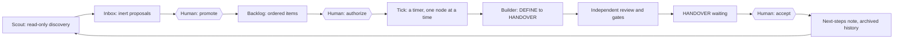

# The full cycle: scout, promote, authorize, cadence, accept

**Example project:** the [JSON API](../api.md) — an orders API that publishes an
OpenAPI description clients rely on.

**When to use this.** Use it when you want to see how the four kinds of loop fit
together, end to end, without anybody deciding in advance what the work should
be. This is the loop-engineering idea — a **Scout** that finds work, a
**Builder** that does it, an **Orchestrator** that keeps the cycle turning —
mapped onto this template, with a person standing in three places where the
original idea has an agent. See [SOURCES.md](../../SOURCES.md) for where that
idea comes from.

```text
scout → inbox → promote → backlog → authorize → tick … tick → HANDOVER → accept
                   ↑ you                ↑ you                              ↑ you
```

## Where the human sits



The three diamond-shaped boxes are the only places a person is required. Every
arrow between them can be driven by a timer. Nothing skips a diamond.

## In chat

**1. Ask what is worth doing at all.**

```text
Scout this API project and show me the proposals that came back: title, outcome
and the evidence each one points at. Do not promote anything and do not start
anything.
```

*(calls `loop_scout`, then `loop_inbox_list`. The provider runs in a disposable
copy of the project with read-only tooling; nothing in the real project
changes.)*

**2. Decide which proposal becomes work.**

```text
Promote the proposal about the contract drift on GET /orders into the backlog as
a defect, and discard the one about renaming the internal helper. Then list the
backlog.
```

*(calls `loop_promote`, which returns a confirmation link naming the proposal and
the digest of its exact text; you type `PROMOTE` into the field. `loop_discard`
completes directly. Then `loop_backlog_list`.)*

**3. Decide that it may run.**

```text
Authorize that promoted item: scope it to the API source and its contract tests,
20 rounds, 1800 seconds, expiring in 12 hours, stopping at the first failed gate.
Do not start it.
```

*(calls `loop_authorize`, which returns a second confirmation link. You type
`AUTHORIZE`.)*

**4. Let the cadence move it.**

```text
Every 30 minutes, call tick on this project and tell me only when the action is
not "nothing", or when the run status becomes BLOCKED or WAITING_FOR_HUMAN.
```

*(calls `loop_tick` on each repetition)*

**5. Decide that it is done.**

```text
Show me the handover: the changed files, the review verdict, the validation
evidence and the remaining risks. Do not accept yet.
```

```text
I have read the handover and I accept it. Note: reviewed locally; nothing
deployed.
```

*(calls `loop_status`, then `loop_accept`, which returns a third confirmation
link. You type `ACCEPT`. Accepting archives the run and promotes the next queued
item as a fresh, paused work item — which is where the cycle begins again.)*

## On the command line

```bash
ROOT=/absolute/path/to/target-project

# 1. Discovery. Read-only, changes nothing.
build-loop scout --root "$ROOT" --input '{"provider":"claude"}' --json
build-loop inbox_list --root "$ROOT" --json

# 2. Triage. Promoting is a human decision.
build-loop promote --root "$ROOT" \
  --input '{"proposal_id":"P-20260907T101530Z-1","id":"WI-060","work_kind":"defect"}'
# Type PROMOTE to confirm: PROMOTE
build-loop discard --root "$ROOT" \
  --input '{"proposal_id":"P-20260907T101530Z-2"}'

# 3. Permission to start, with limits written down.
build-loop authorize --root "$ROOT" \
  --input '{"item_id":"WI-060","allowed_paths":["src","tests"],"max_rounds":20,"max_wall_seconds":1800,"expires_in_seconds":43200,"stop_on_first_failure":true}'
# Type AUTHORIZE to confirm: AUTHORIZE

# 4. The cadence. One tick by hand first, to see what it does.
build-loop tick --root "$ROOT" --json
# {"action":"started","reason":"started-authorized-item", …}

# …then on a timer:
# */30 * * * * cd /absolute/path/to/target-project && build-loop tick --root /absolute/path/to/target-project >> .loop/control/tick-cron.log 2>&1

# 5. Read, then accept.
build-loop check --root "$ROOT" --json
build-loop status --root "$ROOT" --json
build-loop accept --root "$ROOT"
# Type ACCEPT to confirm: ACCEPT

# 6. What the last cycle wants the next one to know.
cat "$ROOT/.loop/notes/next-steps.md"
```

## The memory between cycles

When a run reaches HANDOVER the loop writes one small note,
`.loop/notes/next-steps.md`: the work item and run ids, a summary of the rounds
and gate results, three priorities read out of that evidence, the first item
waiting in the backlog, and the evidence ids of the last round.

That note is the shared memory the loop-engineering write-ups describe, and it is
what makes this a cycle rather than a series of unrelated runs: the next DEFINE
brief and every scout brief carry it along. Here it is deliberately **advisory**.
It approves nothing, it widens no scope, and `accept` copies it into history
rather than acting on it.

## What you check as the human

- **Three decisions, three links.** Promoting, authorizing and accepting are
  separate. Each has its own confirmation page showing exactly what would happen.
  If a page shows something you did not ask for, close it — nothing is written
  until you press the button.
- **Is the proposal real?** A scout reads code and text; it does not run your
  contract tests. Look at the evidence pointers before you promote.
- **Is it bounded?** Promote the version of a proposal you would be willing to
  authorize. "Restructure the persistence layer" is not a work item.
- **Verified success at the end.** `judge_verdict` is `PASS` **and** the VALIDATE
  gate passed. `handover_ready` alone only means there is something to look at.
- **What the next cycle inherits.** Read the next-steps note before the next
  scout run, so you notice when the loop keeps proposing the same thing.

## What can never happen by itself

- **The cycle cannot close itself.** A scout proposal never becomes a work item,
  a work item never becomes a run, and a run never becomes an accepted result,
  without a person typing a word.
- **Discovery changes nothing.** `scout` runs a bundled wrapper in a disposable
  copy with read-only tooling, and there is no argument for pointing it at
  another program.
- **The next-steps note is not an instruction.** It is an input to the next
  brief. Nothing in the loop reads a decision out of it.
- **The cadence grants nothing.** A tick can only start an item a person already
  authorized as READY, inside the recorded scope, budget and expiry.
- **Nothing leaves the machine.** Merging, pushing, deploying and releasing are
  separate human actions after the handover.

Next: try all of it with no AI and no cost — [the dry run](dry-run.md).
